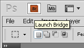
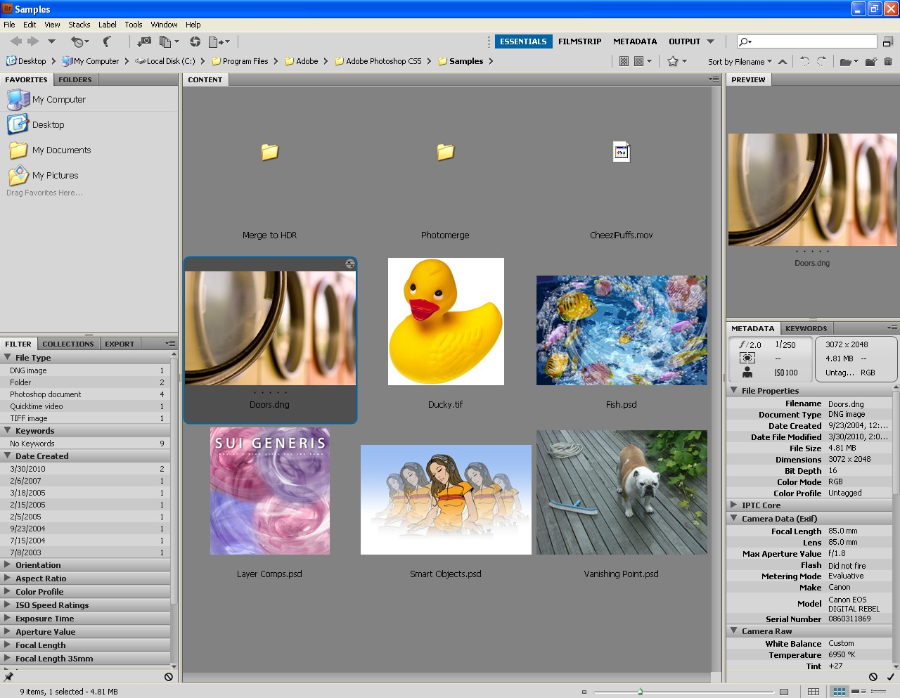
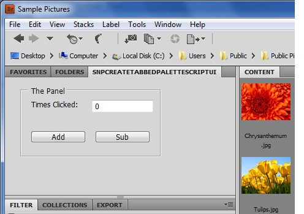
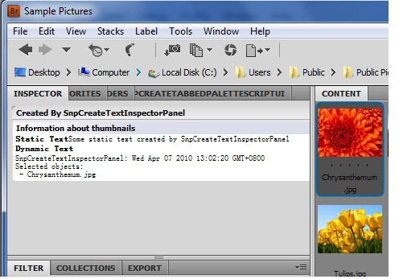
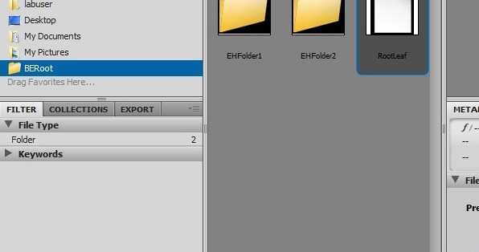
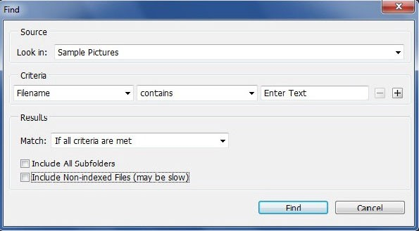
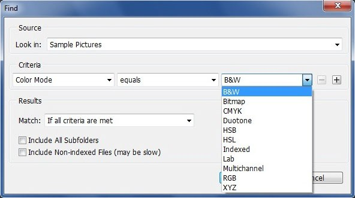
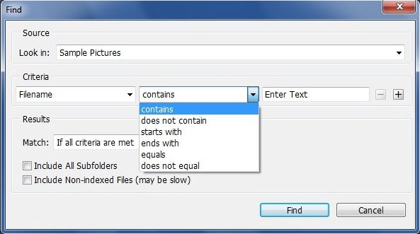
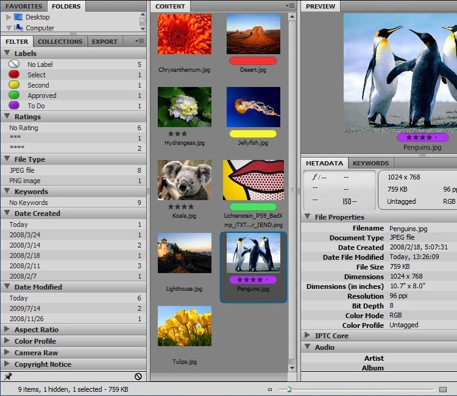

# **ADOBE® BRIDGE 2020 JAVASCRIPT GUIDE**


> &copy; 2020 Adobe Systems Incorporated. All rights reserved.
>
> Adobe® Creative Cloud: Adobe Bridge 2020 JavaScript Guide for Windows®
> and Macintosh®.
>
> If this guide is distributed with software that includes an end user
> agreement, this guide, as well as the software described in it, is
> furnished under license and may be used or copied only in accordance
> with the terms of such license. Except as permitted by any such
> license, no part of this guide may be reproduced, stored in a
> retrieval system, or transmitted, in any form or by any means,
> electronic, mechanical, recording, or otherwise, without the prior
> written permission of Adobe Systems Incorporated. Please note that the
> content in this guide is protected under copyright law even if it is
> not distributed with software that includes an end user license
> agreement.
>
> The content of this guide is furnished for informational use only, is
> subject to change without notice, and should not be construed as a
> commitment by Adobe Systems Incorporated. Adobe Systems Incorporated
> assumes no responsibility or liability for any errors or inaccuracies
> that may appear in the informational content contained in this guide.
>
> Please remember that existing artwork or images that you may want to
> include in your project may be protected under copyright law. The
> unauthorized incorporation of such material into your new work could
> be a violation of the rights of the copyright owner. Please be sure to
> obtain any permission required from the copyright owner.
>
> Any references to company names in sample templates are for
> demonstration purposes only and are not intended to refer to any
> actual organization.
>
> Adobe, the Adobe logo, Illustrator, Photoshop, InDesign, and Drive are
> either registered trademarks or trademarks of Adobe Systems
> Incorporated in the United States and/or other countries.
>
> Microsoft and Windows are either registered trademarks or trademarks
> of Microsoft Corporation in the United States and/or other countries.
> Apple, Mac, Mac OS, and Macintosh are trademarks of Apple Computer,
> Incorporated, registered in the United States and other countries. Sun
> and Java are trademarks or registered trademarks of Sun Microsystems,
> Incorporated in the United States and other countries. UNIX is a
> registered trademark of The Open Group in the US and other countries.
>
> Adobe Systems Incorporated, 345 Park Avenue, San Jose, California
> 95110, USA. Notice to U.S. Government End Users. The Software and
> Documentation are "Commercial Items," as that term is defined at 48
> C.F.R. §2.101, consisting of "Commercial Computer Software" and
> "Commercial Computer Software Documentation," as such terms are used
> in 48
>
> C.F.R. §12.212 or 48 C.F.R. §227.7202, as applicable. Consistent with
> 48 C.F.R. §12.212 or 48 C.F.R. §§227.7202-1 through 227.7202-4, as
> applicable, the Commercial Computer Software and Commercial Computer
> Software Documentation are being licensed to U.S. Government end users
> (a) only as Commercial Items and (b) with only those rights as are
> granted to all other end users pursuant to the terms and conditions
> herein. Unpublished-rights reserved under the copyright laws of the
> United States. Adobe Systems Incorporated, 345 Park Avenue, San Jose,
> CA 95110-2704, USA. For U.S. Government End Users, Adobe agrees to
> comply with all applicable equal opportunity laws including, if
> appropriate, the provisions of Executive Order 11246, as amended,
> Section 402 of the Vietnam Era Veterans Readjustment Assistance Act of
> 1974 (38 USC 4212), and Section 503 of the Rehabilitation Act of 1973,
> as amended, and the regulations at 41 CFR Parts 60-1 through 60-60,
> 60-250, and 60-741. The affirmative action clause and regulations
> contained in the preceding sentence shall be incorporated by
> reference.

## Contents

========

[Welcome 6](#welcome)

[About This Book 6](#about-this-book)

[Who should read this book 6](#who-should-read-this-book)

[What is in this book 7](#what-is-in-this-book)

[Document conventions 7](#document-conventions)

> [Typographical conventions 7](#typographical-conventions)

[Where to go for more information 7](#where-to-go-for-more-information)

1. [Scripting Adobe Bridge 9](#scripting-adobe-bridge)

[Scripting Overview 9](#scripting-overview)

[Documentation and sample code 9](#documentation-and-sample-code)

[Executing scripts for Adobe Bridge 10](#executing-scripts-for-adobe-bridge)

[The Adobe Bridge Browser Window and Object Model 11](#the-adobe-bridge-browser-window-and-object-model)

[The Adobe Bridge browser window 11](#the-adobe-bridge-browser-window)

[Accessing the Adobe Bridge browser through scripts 12](#accessing-the-adobe-bridge-browser-through-scripts)

[The Adobe Bridge Object Model 15](#the-adobe-bridge-object-model)

[Basic node model 16](#basic-node-model)

> [The application and documents 16](#the-application-and-documents)
>
> [Thumbnails in documents 16](#thumbnails-in-documents)

[Scripting Adobe Bridge interactions 17](#scripting-adobe-bridge-interactions)

> [Application preferences 17](#application-preferences)
>
> [User-interaction events 17](#user-interaction-events)

[Customizing the user interface 18](#customizing-the-user-interface)

> [Customizing the browser window 18](#customizing-the-browser-window)
>
> [Communicating with the user from a script 19](#communicating-with-the-user-from-a-script)

[Extending browser behavior 21](#extending-browser-behavior)

2. [Interacting with Adobe Bridge through Scripts 23](#interacting-with-adobe-bridge-through-scripts)

[Accessing Thumbnails with Scripts 23](#accessing-thumbnails-with-scripts)

[Thumbnails as node references 23](#thumbnails-as-node-references)

> [Using and accessing thumbnails 24](#using-and-accessing-thumbnails)

[Accessing many thumbnails correctly 24](#accessing-many-thumbnails-correctly)

> [Ensuring valid thumbnail data 25](#ensuring-valid-thumbnail-data)
>
> [Location of Camera settings for thumbnails 25](#location-of-camera-settings-for-thumbnails)

[Metadata for thumbnails 25](#metadata-for-thumbnails)

[Embedding metadata in a script as XML 26](#embedding-metadata-in-a-script-as-xml)

[Event Handling in Adobe Bridge 27](#event-handling-in-adobe-bridge)

[Defining event handlers 27](#defining-event-handlers)

[Registering event handlers 28](#registering-event-handlers)

[Communicating with Other Applications 28](#communicating-with-other-applications)

3.  [Creating a User Interface for a Script 30](#creating-a-user-interface-for-a-script)

[User Interface Options for Scripts 30](#user-interface-options-for-scripts)

[Navigation bars 30](#navigation-bars-1)

> [Dialogs boxes 31](#dialogs-boxes)

[Content pane 31](#content-pane)

[Tabbed palettes 31](#tabbed-palettes)

[Displaying ScriptUI in Adobe Bridge 32](#displaying-scriptui-in-adobe-bridge)

> [Displaying ScriptUI dialogs 32](#displaying-scriptui-dialogs)
>
> [Displaying ScriptUI elements in a navigation bar 32](#displaying-scriptui-elements-in-a-navigation-bar)
>
> [Displaying ScriptUI elements in a custom palette 33](#bookmark132)

4.  [Customizing the Adobe Bridge Browser Window 34](#customizing-the-adobe-bridge-browser-window)

[Creating a Customized Tabbed Palette 34](#creating-a-customized-tabbed-palette)

[Script-Defined Inspector Panels 35](#script-defined-inspector-panels)

[Creating and displaying inspector panels 36](#creating-and-displaying-inspector-panels)

> [Specifying string values in an inspector panel 36](#specifying-string-values-in-an-inspector-panel)

[Panelette markup elements for dynamic text 37](#panelette-markup-elements-for-dynamic-text)

[Markup examples 37](#markup-examples)

> [Extending Adobe Bridge Menus 38](#extending-adobe-bridge-menus)

5.  [Extending Adobe Bridge Node-Handling Behavior 39](#extending-adobe-bridge-node-handling-behavior)

[Creating Script-Defined Node-Handling Extensions 39](#creating-script-defined-node-handling-extensions)

[Registering your node-handling extension 40](#registering-your-node-handling-extension)

> [Installing a node-handling extension 40](#installing-a-node-handling-extension)

[Installation structure 41](#installation-structure)

[Extension workspaces 42](#extension-workspaces)

[Shared startup scripts 42](#shared-startup-scripts)

> [Accessing the node-handling model and data 42](#accessing-the-node-handling-model-and-data)
>
> [Defining an ExtensionHandler 43](#defining-an-extensionhandler)
>
> [Immediate handler operations 43](#immediate-handler-operations)
>
> [Long-running handler operations 44](#long-running-handler-operations)
>
> [Defining an ExtensionModel 45](#defining-an-extensionmodel)
>
> [Immediate model operations 46](#immediate-model-operations)
>
> [Long-running model operations 49](#long-running-model-operations)
>
> [Defining Node Data Sets 50](#defining-node-data-sets)
>
> [Managing the data cache 51](#managing-the-data-cache)
>
> [Core node data 52](#core-node-data)
>
> [Defining Long-Running Operations 52](#defining-long-running-operations)
>
> [Implementing an operation 53](#implementing-an-operation)
>
> [Monitoring operation progress and status 54](#monitoring-operation-progress-and-status)
>
> [Resolving conflicts 56](#resolving-conflicts)
>
> [Defining Node Searches and Filters 57](#defining-node-searches-and-filters)
>
> [Handling interactive node searches 57](#handling-interactive-node-searches)

[Implementing getSearchDefinition() 58](#implementing-getsearchdefinition)

[Implementing getBridgeUriForSearch() 60](#implementing-getbridgeuriforsearch)

> [Adding filters 60](#adding-filters)

[Implementing the getFilterCriteria() method 61](#implementing-the-getfiltercriteria-method)

6. [Porting Guide 62](#porting-guide)

[Changes and Deprecations from Adobe Bridge CS6 62](#changes-and-deprecations-from-adobe-bridge-cs6)

[Index 63](#index)

Welcome
=======

> Welcome to the *Adobe Bridge 2020 JavaScript Guide*. This book
> describes how to use JavaScript to manipulate and extend Adobe®
> Bridge, a powerful file-browser available with many Adobe
> applications, which you can invoke using the Browse In Bridge menu
> option.

{width="1.7955129046369205in"
height="1.03125in"}

> Adobe Bridge provides a highly customizable platform that can be
> extended using a rich JavaScript API and Flash® components. It
> includes the ExtendScript Toolkit, an interactive development
> environment for JavaScript.

About This Book
---------------

> This document describes how to use the scripting API to extend and
> manipulate Adobe Bridge. Complete reference information for the
> JavaScript objects, properties, and functions defined by Adobe Bridge
> is provided in a companion document, the *Adobe Bridge JavaScript
> Reference*.*Adobe Creative Suite: Introduction to Scripting*

-   Adobe provides the *ExtendScript Toolkit* an interactive development
    > environment (IDE) for JavaScript, with all JavaScript-enabled
    > Adobe applications. The ExtendScript Toolkit is documented in the
    > *JavaScript Tools Guide*. This book also provides documentation
    > for various utilities and tools that are part of ExtendScript, the
    > Adobe extended implementation of JavaScript.

-   The Adobe Bridge SDK, which contains this document, also contains a
    > set of code samples ("Snippets"), that demonstrate how to use the
    > features of the Bridge JavaScript API. This book refers to these
    > samples by name for illustration of concepts and techniques. You
    > can download the SDK from Adobe Developer Center,
    > [[h](http://www.adobe.com/devnet/)ttp:[//w](http://www.adobe.com/devnet/)ww]{.underline}[[.adobe.com/devnet/]{.underline}.](http://www.adobe.com/devnet/)

### Who should read this book

> This book is for developers who want to extend the capabilities of
> Adobe Bridge using JavaScript, call Bridge functionality from scripts,
> and use scripts to communicate between Bridge-enabled applications. It
> assumes a general familiarity with the following:

-   JavaScript

-   Adobe Bridge

-   Any other Bridge-enabled applications you are using, such as Adobe
    > Illustrator®, Adobe Photoshop®, or Adobe InDesign®. The scripting
    > API details for each application are included with the scripting
    > documentation for that product.

> If you have already been using the scripting interface to Bridge, see
> [Chapter 6, "PortingGuide](#porting-guide)" for information about changes in
> this release.

**6**

### What is in this book

> This book contains the following chapters:

-   [Chapter 1, "Scripting Adobe Bridge](#scripting-adobe-bridge)," introduces some
    > important concepts in Adobe Bridge scripting and describes the
    > Bridge JavaScript document object model (DOM).

-   [Chapter 2, "Interacting with Adobe Bridge through Scripts](#interacting-with-adobe-bridge-through-scripts),"
    > discusses the various ways of accessing Thumbnail objects,
    > describes how Bridge generates user-interaction events, and shows
    > how you can respond to these events by defining event handlers in
    > your scripts.

-   [Chapter 3,User]{.underline} [Interface]{.underline} [for]{.underline} [a Script](#creating-a-user-interface-for-a-script),"
    > discusses the various options available to scripts for interaction
    > with Bridge users, such as dialog boxes and navigation bars, and
    > describes how to use these means to display a user interface
    > defined in ScriptUI.

-   [Chapter 4, "Customizing the Adobe Bridge BrowserWindow](#customizing-the-adobe-bridge-browser-window)"
    > describes how to add a script-defined palette to Bridge, how to
    > build a customized object-inspector pane that displays information
    > related to the selected node in any way you choose, and how to
    > customize Bridge menus.

-   [Chapter 5, "Extending Adobe Bridge Node-Handling Behavior](#extending-adobe-bridge-node-handling-behavior),"
    > is intended for tool developers. It describes how to extend the
    > node-handling behavior of Bridge and define your own node types.

-   [Chapter 6, "Porting Guide](#porting-guide),"
    > summarizes changes and additions to this release, to help you in
    > porting existing scripting applications.

### Document conventions

#### Typographical conventions

+----------------------------------+----------------------------------+
| Monospaced font                  | > Literal values; code, such as  |
|                                  | > JavaScript or HTML code; file  |
|                                  | > and path names.                |
+==================================+==================================+
| *Italics*                        | > Variables or placeholders in   |
|                                  | > code. For example, in          |
|                                  | > name=\"*myName*\", the text    |
|                                  | > *myName* represents a value    |
|                                  | > you are expected to supply,    |
|                                  | > such as name=\"Fred\". Also    |
|                                  | > indicates the first occurrence |
|                                  | > of a new term.                 |
+----------------------------------+----------------------------------+
| [Blue underlined                 | > An active link to a related    |
| text]{.underline}                | > section in this book or to a   |
|                                  | > URL in your web browser.       |
+----------------------------------+----------------------------------+
| **Sans-serif bold font**         | > The names of Bridge UI         |
|                                  | > elements (menus, menu items,   |
|                                  | > and buttons).                  |
|                                  | >                                |
|                                  | > The **\>** symbol is used as   |
|                                  | > shorthand notation for         |
|                                  | > navigating to menu items. For  |
|                                  | > example, **Edit \> Cut**       |
|                                  | > refers to the **Cut** item in  |
|                                  | > the **Edit** menu.             |
+----------------------------------+----------------------------------+

> **NOTE:** Notes highlight important points that deserve extra
> attention.

### Where to go for more information

-   For complete reference information for the JavaScript objects,
    > properties, and functions defined by Adobe Bridge, see the *Adobe
    > Bridge JavaScript Reference*.

-   Adobe provides an extended version of JavaScript, used in many Adobe
    > products, called ExtendScript. ExtendScript is a complete
    > implementation of ECMA JavaScript, plus additional tool and
    > utilities.

> The JavaScript API includes rich functionality such as building blocks
> for user interface elements and network connectivity. In addition, it
> allows you to develop C and C++ native extensions.
>
> For a description of the objects, tools, and utilities defined by
> Adobe ExtendScript, including the ExtendScript Toolkit, see:
>
> *JavaScript Tools Guide*

-   For a general introduction to scripting as a tool for working with
    > Adobe applications, see:

> *Adobe Creative Suite: Introduction to Scripting*
>
> This book does not describe the JavaScript language. For documentation
> of the JavaScript language or descriptions of how to use it, see any
> of numerous works on this subject, including the following:

-   []{#bookmark9 .anchor}The public JavaScript standards organization
    > web site:
    > [[www.ecma-international.org](http://www.ecma-international.org/)

```{=html}
<!-- -->
```
-   *JavaScript: The Definitive Guide, 4th Edition*; Flanagan, D.;
    > O'Reilly 2001; ISBN 0-596-00048-0

-   *JavaScript Programmer's Reference*; Wootton, C.; Wrox 2001; ISBN
    > 1-861004-59-1

-   *JavaScript Bible. 5th Edition*; Goodman, D. and Morrison, M.; John
    > Wiley and Sons1998; ISBN 0-7645-57432

Scripting Adobe Bridge
======================

> This chapter introduces some important concepts in Adobe Bridge
> scripting and describes the Adobe Bridge JavaScript API object model.
> For detailed descriptions of the objects and their properties and
> methods, see the *Adobe Bridge JavaScript Reference*.
>
> **NOTE:** If you have already been using the scripting interface to
> Adobe Bridge, see [Chapter 6, "Porting](#porting-guide)
> [Guide](#porting-guide)" for information about changes
> in this release.

Scripting Overview
------------------

> []{#_bookmark13 .anchor}Adobe Bridge provides a configurable,
> extensible browser platform that allows users to search for, select,
> and organize files by navigating among files and folders in the local
> file system, those on remote file systems, and also web pages
> accessible over the Internet.
>
> Adobe Bridge is integrated with Adobe applications, which bring up the
> Adobe Bridge browser window in response to specific user actions that
> require file selection, or through a Browse button or command. You can
> also bring up a browser window independently, by invoking it
> interactively or through a script.
>
> The browser is highly configurable and extensible, using JavaScript.
> Adobe Bridge supports ExtendScript, the Adobe extended implementation
> of JavaScript. ExtendScript files are distinguished by the .jsx
> extension. ExtendScript offers all standard JavaScript features, plus
> additional features and utilities, such as:

-   Platform-independent file and folder representation

-   Tools for building a user interface to a script

-   An interactive development and debugging environment, the
    > ExtendScript Toolkit

-   For details of these features, see the *JavaScript Tools Guide*.

> You can use JavaScript to manipulate browser windows and their
> contents programmatically, and to change and extend their
> functionality. This manual describes what you can do, and provides an
> overview of the JavaScript objects and functions that you can use to
> program Adobe Bridge.

### Documentation and sample code

> []{#_bookmark15 .anchor}The Adobe Bridge Software Developer's Kit
> (SDK), available from Adobe Developer Center,
> [http://www.adobe.com/devnet/](http://www.adobe.com/devnet/),
> contains many code samples for Adobe Bridge and the JavaScript tools.
> You can download and install the SDK in a folder with a name and
> location of your choice, referred to here as *sdkInstall*. The SDK
> contains:
>
> *sdkInstall*/docs/ This document, and the companion documents *Adobe
> Bridge JavaScript Reference* and *JavaScript Tools Guide*.

**9**

> *sdkInstall*/javascript/docs/ Documentation for all of the JavaScript
> sample code in HTML
>
> format.
>
> *sdkInstall*/javascript/sdksamples/ A set of JavaScript code samples
> that illustrate Adobe Bridge
>
> scripting concepts and techniques.
>
> The sections in this manual that discuss particular concepts list the
> code samples that demonstrate the related techniques.

### Executing scripts for Adobe Bridge

> Adobe Bridge executes JavaScript scripts in any of these ways:

-   You can load and run a script in the ExtendScript Toolkit,
    > specifying Adobe Bridge 2020 as the target application. This is
    > how to run the example code Snippets. The Toolkit is a development
    > environment for JavaScript, in which you can see debugging output
    > and step through execution.

> If you run a script for the ExtendScript Toolkit that has Adobe Bridge
> as its target, the Toolkit automatically launches Adobe Bridge if it
> is not already running. Similarly, if another application sends a
> JavaScript message to Adobe Bridge, the messaging framework launches
> Adobe Bridge if necessary. For details of the Toolkit and messaging
> framework, see the *JavaScript Tools Guide*.

-   You can create a menu command that runs a script and add it to a
    > menu or submenu in the Adobe Bridge browser, using the MenuElement
    > object. See ['Extending Adobe Bridge Menus' on page 38](#extending-adobe-bridge-menus).

-   When the browser window displays a JSX file, you can double-click
    > that file thumbnail to run the script in its target application.
    > It runs in Adobe Bridge if the script specifies Adobe Bridge as
    > its target application by including the directive:

> \#target bridge-4.0

-   If the script specifies another application as its target,
    > ExtendScript prompts the user to start that application if
    > necessary. If the script does not specify a target application, it
    > opens in the ExtendScript Toolkit. For details of application
    > specifier syntax, see the *JavaScript Tools Guide*.

-   You can pass a script to the Adobe Bridge executable, to be executed
    > on startup, by dragging the JSX file icon onto the Adobe Bridge
    > executable file icon or shortcut. This script is executed after
    > all startup scripts found in the startup folders.

-   Adobe Bridge has a dedicated location for user-installed startup
    > scripts. This is the location referred to by the **Reveal My
    > Startup Scripts** button in the Preference/Startup Scripts panel.
    > All JSX files found in these locations are automatically run when
    > Adobe Bridge is launched.

-   []{#_bookmark18 .anchor}In Windows, the user startup folder is:

> %APPDATA%\\Adobe\\Bridge 2020\\Startup Scripts\\

-   In Mac OS, the user startup folder is:

> \~/Library/Application Support/Adobe/Bridge 2020/Startup Scripts/
>
> Other locations are used for the Adobe startup scripts that are
> supplied on installation of Adobe
>
> Bridge-enabled applications. As a third-party developer, you must be
> very careful when installing anything in these locations. They should
> be used only for extensions to the Adobe Bridge node-handling model
> that support companion applications. For details, see [[Chapter 5, "Extending]{.underline} [Adobe Bridge Node-Handling](#extending-adobe-bridge-node-handling-behavior)
> [Behavior](#extending-adobe-bridge-node-handling-behavior).

The Adobe Bridge Browser Window and Object Model
------------------------------------------------

> []{#_bookmark20 .anchor}An object model is an application programming
> interface (API), which allows you to programmatically access various
> components of a *document* (as defined for that application) through a
> scripting language such as JavaScript. In the case of Adobe Bridge, a
> \"document\" is defined as the browser window. This section shows how
> each aspect of the API relates to the parts of the browser. A more
> detailed description of the objects of the Adobe Bridge model follows
> in ['The Adobe Bridge Object Model' onpage]{.underline} [15](#the-adobe-bridge-object-model).

### The Adobe Bridge browser window

> []{#_bookmark23 .anchor}The browser window is highly configurable. A
> browser configuration is called a *workspace*. There are predefined
> workspaces, and you can save and set the workspace interactively
> through the **Window \> Workspace** menu, or through a script.
> User-defined workspaces are saved as XML files with the
>
> .workspace extension, in these locations:

-   In Windows, the user workspace folder is:

> %APPDATA%\\Adobe\\Bridge 2020\\Workspaces\\

-   In Mac OS, the user workspace folder is:

> \~/Library/Application Support/Adobe/Bridge 2020/Workspaces/
>
> The following figure identifies parts of the browser window in a
> default configuration and viewing mode.
>
> Menu bar
>
> Upper Navigation bar
>
> FOLDER and FAVORITES
>
> panels
>
> FAVORITES:
>
> *Standard* section
>
> FAVORITES:
>
> *User* section
>
> Thumbnails
>
> CONTENT pane
>
> Browser Modes and Workspaces
>
> [ ]{.underline} Search
>
> PREVIEW
>
> panel
>
> Flyout menu
>
> FILTER panel
>
> METADATA
>
> and KEYWORDS
>
> panels
>
> Status Line
>
> Tabbed panels
>
> []{#_bookmark24 .anchor}The tabbed palettes are arranged in three
> columns. You can change the arrangement interactively. Columns can be
> resized, and palette groups can also be resized within the column.
> Individual tabbed palettes can be opened and closed, and dragged into
> different relative positions. Dragging a palette to the bottom of an
> existing set adds a new tab set at the bottom of that column.
>
> Your scripts can add customized palettes and menus, and control
> various aspects of the window configuration and display.

### Accessing the Adobe Bridge browser through scripts

> []{#_bookmark27 .anchor}The following table describes how the Adobe
> Bridge JavaScript API maps to the various parts and features of the
> browser window, and how a script can access each part or feature
> through the Adobe Bridge object model.

+----------------------+----------------------+----------------------+
| **Window area**     | > **Purpose**        | > **Scripting        |
|                      |                      | > control**          |
+======================+======================+======================+
| Browser window       | > Displays files,    | > Represented by the |
|                      | > folders, and web   | > Document object.   |
|                      | > pages, along with  | > Current browser    |
|                      | > related file       | > window (the one    |
|                      | > information and    | > with the operating |
|                      | > tools.             | > system focus) is   |
|                      |                      | > in app.document.   |
|                      |                      | > All open browser   |
|                      |                      | > windows are in     |
|                      |                      | > app.documents.     |
|                      |                      | >                    |
|                      |                      | > A script can       |
|                      |                      | > create a new       |
|                      |                      | > browser window by  |
|                      |                      | > creating a new     |
|                      |                      | > Document object.   |
|                      |                      | >                    |
|                      |                      | > The browser mode   |
|                      |                      | > (full or compact)  |
|                      |                      | > is controlled by   |
|                      |                      | > app.d              |
|                      |                      | ocument.browserMode. |
|                      |                      | >                    |
|                      |                      | > The overall        |
|                      |                      | > configuration of   |
|                      |                      | > palettes is        |
|                      |                      | > controlled by      |
|                      |                      | > app                |
|                      |                      | .document.workspace. |
|                      |                      | > All defined        |
|                      |                      | > configurations are |
|                      |                      | > in app.workspaces. |
+----------------------+----------------------+----------------------+
| []{#_bookmark28      | > The labeled icons  | > The Thumbnail      |
| .anchor}Thumbnails   | > that appear in the | > object represents  |
|                      | > Folders/Favorites  | > a node in the      |
|                      | > panes as           | > browser navigation |
|                      | > navigation nodes,  | > hierarchy.         |
|                      | > and in the Content | >                    |
|                      | > pane and Preview   | > Thumbnails can     |
|                      | > palette to         | > represent File or  |
|                      | > represent files    | > Folder objects,    |
|                      | > and folders.       | > URLs, or           |
|                      |                      | > script-defined     |
|                      |                      | > nodes associated   |
|                      |                      | > with               |
|                      |                      | > script-defined     |
|                      |                      | >                    |
|                      |                      | > node-handling      |
|                      |                      | > extensions. Adobe  |
|                      |                      | > Drive nodes are an |
|                      |                      | > example of         |
|                      |                      | > script-defined     |
|                      |                      | > nodes with their   |
|                      |                      | > own behavior.      |
|                      |                      | >                    |
|                      |                      | > ***Note:** Adobe   |
|                      |                      | > Drive support is   |
|                      |                      | > not available in   |
|                      |                      | > Adobe Bridge       |
|                      |                      | > anymore as it was  |
|                      |                      | > based on Flash     |
|                      |                      | > runtime.*          |
+----------------------+----------------------+----------------------+

+----------------------+----------------------+----------------------+
| []{#_bookmark29      | > Provides a place   | > Access the visible |
| .anchor}Favorites    | > for users to drag  | > thumbnails through |
| palette              | > and drop favorite  | > the app.favorites  |
|                      | > items (in the      | > property, and      |
|                      | > bottom half of the | > traverse the       |
|                      | > pane).             | > hierarchy through  |
|                      | >                    | > the                |
|                      | > Displays only      | > Thumbnail.children |
|                      | > top-level          | > properties.        |
|                      | > containers and one | >                    |
|                      | > level of subnodes. | > The Favorites      |
|                      |                      | > object allows you  |
|                      |                      | > to add thumbnails  |
|                      |                      | > to this pane.      |
|                      |                      | >                    |
|                      |                      | > User interaction   |
|                      |                      | > with a thumbnail   |
|                      |                      | > in this pane       |
|                      |                      | > generates an event |
|                      |                      | > with a Thumbnail   |
|                      |                      | > target object and  |
|                      |                      | > a location of      |
|                      |                      | > favorites.         |
+======================+======================+======================+
| []{#_bookmark30      | > Displays the       | > Access the         |
| .anchor}Folder       | > file-system        | > currently selected |
| palette              | > navigation         | > thumbnail in the   |
|                      | > hierarchy.         | > Folders pane       |
|                      | >                    | > through the        |
|                      | > Displays only      | > Document.thumbnail |
|                      | > containers (such   | > property. Traverse |
|                      | > as folders and     | > the hierarchy      |
|                      | > subfolders). The   | > through the        |
|                      | > content of the     | > Thumbnail.parent   |
|                      | > selected container | > and                |
|                      | > appears in the     | > Thumbnail.children |
|                      | > Content pane.      | > properties.        |
|                      |                      | >                    |
|                      |                      | > User interaction   |
|                      |                      | > with a thumbnail   |
|                      |                      | > in this pane       |
|                      |                      | > generates an event |
|                      |                      | > with a Thumbnail   |
|                      |                      | > target object and  |
|                      |                      | > a location of      |
|                      |                      | > document.          |
+----------------------+----------------------+----------------------+
| []{#_bookmark31      | > Displays container | > Controlled by the  |
| .anchor}Content pane | > contents when you  | > Docume             |
|                      | > select a container | nt.presentationMode, |
|                      | > node in the        | > which you set with |
|                      | > Folders or         | > Document.s         |
|                      | > Favorites palette, | etPresentationMode() |
|                      | > or when you        | > to the value:      |
|                      | > double-click a     | >                    |
|                      | > navigable node     | > browser: Displays  |
|                      | > (such as a folder) | > file and folder    |
|                      | > in the Content     | > nodes, represented |
|                      | > pane itself.       | > by Thumbnail       |
|                      | >                    | > objects, found at  |
|                      | > Displays both      | > the path specified |
|                      | > containers (such   | > in                 |
|                      | > as subfolders) and | > Docume             |
|                      | > leaf nodes (such   | nt.presentationPath. |
|                      | > as files and       | > When a folder is   |
|                      | > images).           | > selected in the    |
|                      |                      | > Folders pane,      |
|                      |                      | > access the current |
|                      |                      | > contents of the    |
|                      |                      | > Content pane       |
|                      |                      | > through            |
|                      |                      | > app.document.thu   |
|                      |                      | mbnail.children\[\]. |
|                      |                      | >                    |
|                      |                      | > User interaction   |
|                      |                      | > with a thumbnail   |
|                      |                      | > in this pane       |
|                      |                      | > generates an event |
|                      |                      | > with a Thumbnail   |
|                      |                      | > target object and  |
|                      |                      | > a location of      |
|                      |                      | > document.          |
|                      |                      | >                    |
|                      |                      | > The selected       |
|                      |                      | > thumbnails are     |
|                      |                      | > available through  |
|                      |                      | >                    |
|                      |                      | Document.selections. |
+----------------------+----------------------+----------------------+
| []{#_bookmark32      | > Displays image     | > User interaction   |
| .anchor}Preview      | > previews.          | > with a thumbnail   |
| palette              |                      | > in this pane       |
|                      |                      | > generates an event |
|                      |                      | > with a Thumbnail   |
|                      |                      | > target object and  |
|                      |                      | > a location of      |
|                      |                      | > preview.           |
+----------------------+----------------------+----------------------+

+----------------------+----------------------+----------------------+
| []{#_bookmark33      | > Allows you to sort | > The                |
| .anchor}Filter       | > thumbnails in the  | > FilterDescription  |
| palette              | > Content pane, or   | > object allows you  |
|                      | > limit the nodes    | > to specify         |
|                      | > shown to those     | > filtering criteria |
|                      | > matching selected  | > for script-defined |
|                      | > criteria.          | > node types.        |
|                      |                      | >                    |
|                      |                      | > When displaying a  |
|                      |                      | > handled container  |
|                      |                      | > node, Adobe Bridge |
|                      |                      | > builds the list of |
|                      |                      | > filters by calling |
|                      |                      | > the                |
|                      |                      | > developer-defined  |
|                      |                      | >                    |
|                      |                      |  getFilterCriteria() |
|                      |                      | > method of the      |
|                      |                      | > node\'s            |
|                      |                      | > ExtensionModel.    |
+======================+======================+======================+
| []{#_bookmark34      | > Displays embedded  | > Embedded metadata  |
| .anchor}Metadata     | > file metadata      | > is displayed and   |
| palette              | > information.       | > can be modified    |
|                      |                      | > for a specific     |
|                      |                      | > thumbnail. Access  |
|                      |                      | > XMP metadata,      |
|                      |                      | > encapsulated in a  |
|                      |                      | > Metadata object,   |
|                      |                      | > from the           |
|                      |                      | > Thumbnail.metadata |
|                      |                      | > property.          |
|                      |                      | >                    |
|                      |                      | > Set                |
|                      |                      | >                    |
|                      |                      |  app.synchronousMode |
|                      |                      | > before accessing   |
|                      |                      | > or setting         |
|                      |                      | > metadata in a      |
|                      |                      | > script, to ensure  |
|                      |                      | > that Adobe Bridge  |
|                      |                      | > retrieves the      |
|                      |                      | > latest valid data, |
|                      |                      | > and writes new     |
|                      |                      | > values correctly.  |
+----------------------+----------------------+----------------------+
| []{#_bookmark35      | > Displays keyword   | > Use                |
| .anchor}Keywords     | > information.       | > app.impo           |
| palette              |                      | rtKeywordsFromFile() |
|                      |                      | > and                |
|                      |                      | > app.expo           |
|                      |                      | rtKeywordsFromFile() |
|                      |                      | > to get and set     |
|                      |                      | > keywords from      |
|                      |                      | > files. Scripts can |
|                      |                      | > also modify        |
|                      |                      | > keywords defined   |
|                      |                      | > in embedded        |
|                      |                      | > metadata.          |
+----------------------+----------------------+----------------------+
| []{#_bookmark36      | > Script-defined     | > A new palette is   |
| .anchor}Custom       | > tabbed palettes    | > represented by the |
| tabbed palettes (not | > that can be added  | > TabbedPalette      |
| shown)               | > to the default     | > object. A palette  |
|                      | > palettes.          | > can display        |
|                      |                      | > ScriptUI           |
|                      |                      | > user-interface     |
|                      |                      | > elements. The      |
|                      |                      | >                    |
|                      |                      |  TabbedPalette.title |
|                      |                      | > value is shown in  |
|                      |                      | > the tab.           |
+----------------------+----------------------+----------------------+
| []{#_bookmark37      | > An                 | > Each palette is    |
| .anchor}Inspector    | > object-inspection  | > represented by the |
| (not shown)          | > palette that       | > InspectorPanel     |
|                      | > displays further   | > object, which      |
|                      | > information        | > contains one or    |
|                      | > related to a       | > more subpanels.    |
|                      | > selected thumbnail | > The subpanels      |
|                      | > in the Content     | > display            |
|                      | > pane.              | > information        |
|                      | >                    | > related to the     |
|                      | > This type of       | > focus thumbnail,   |
|                      | > palette is         | > directly or        |
|                      | > script-defined;    | > indirectly through |
|                      | > there is no        | > Thumbnail or       |
|                      | > default version.   | > Metadata           |
|                      |                      | > properties.        |
|                      |                      | > Various types of   |
|                      |                      | > subpanel are       |
|                      |                      | > represented by     |
|                      |                      | > subclasses of the  |
|                      |                      | > Panelette base     |
|                      |                      | > class.             |
+----------------------+----------------------+----------------------+
| []{#_bookmark38      | > Various controls   | > The view mode is   |
| .anchor}View mode    | > that set the       | > controlled by      |
| controls             | > viewing mode to    | > app.documen        |
|                      | > predefined pane    | t.thumbnailViewMode. |
|                      | > configurations,    | > You can control    |
|                      | > and set the        | > various aspects of |
|                      | > display size of    | > the view with      |
|                      | > thumbnails in the  | > other Document     |
|                      | > Content pane.      | > properties such as |
|                      |                      | > d                  |
|                      |                      | isplayInspectorView, |
|                      |                      | > showFolders,       |
|                      |                      | > showThumbnailName, |
|                      |                      | > and so on.         |
|                      |                      | >                    |
|                      |                      | > Workspaces are not |
|                      |                      | > accessible to      |
|                      |                      | > scripts.           |
+----------------------+----------------------+----------------------+
| []{#_bookmark39      | > The bottom bar on  | > Set text to be     |
| .anchor}Status line  | > the browser window | > shown in the       |
|                      | > that displays      | > status line with   |
|                      | > current status     | >                    |
|                      | > information.       | > Document.status.   |
+----------------------+----------------------+----------------------+

+----------------------+----------------------+----------------------+
| []{#_bookmark40      | > The menubar at the | > While this is not  |
| .anchor}Menubar      | > top of the browser | > an object under    |
|                      | > window that        | > direct Document    |
|                      | > contains Adobe     | > control, you can   |
|                      | > Bridge commands.   | > add menus and      |
|                      |                      | > commands using the |
|                      |                      | > MenuElement        |
|                      |                      | > object, by         |
|                      |                      | > referring to       |
|                      |                      | > existing menus and |
|                      |                      | > commands.          |
+======================+======================+======================+
| []{#_bookmark41      | > The right-click    | > You can add        |
| .anchor}Context      | > menus associated   | > submenus and       |
| menus                | > with thumbnails,   | > commands to these  |
|                      | > and flyout menus   | > menus using the    |
|                      | > for some palettes, | > MenuElement        |
|                      | > containing         | > object, by         |
|                      | > context-specific   | > referring to       |
|                      | > commands.          | > existing commands. |
+----------------------+----------------------+----------------------+
| []{#_bookmark42      | > The navigation bar | > Not accessible to  |
| .anchor}Browser      | > immediately under  | > scripts.           |
| window upper         | > the menubar. Not   |                      |
| navigation bar       | > configurable.      |                      |
+----------------------+----------------------+----------------------+
| Top and bottom       | > Two configurable   | > Represented by     |
| navigation bars      | > navigation bars    | > predefined NavBar  |
|                      | > that can appear    | > objects, accessed  |
|                      | > above and below    | > through the        |
|                      | > the Content pane.  | > Document.navbars   |
|                      |                      | > property. By       |
|                      |                      | > default, the       |
|                      |                      | > navigation bars    |
|                      |                      | > are invisible. You |
|                      |                      | > can make a bar     |
|                      |                      | > visible, and add   |
|                      |                      | > ScriptUI elements  |
|                      |                      | > to it.             |
+----------------------+----------------------+----------------------+

The Adobe Bridge Object Model
-----------------------------

> Each application has its own object model, whic[]{#_bookmark44
> .anchor}h []{#_bookmark45 .anchor}consists of a hierarchical
> representation of the application, and of the documents used in the
> application. The object model allows you to programmatically access
> and manipulate the document and its components. Since the use of a
> document varies for each application, the object model terminology
> varies for each application. For example, each application\'s object
> model includes a Document class, but the object referred to is
> different for each application, and the Document class has different
> properties and methods for each application.
>
> Applications typically define a Document class to deal with files of a
> particular type, such as HTML pages, images, or PDF documents.
> However, Adobe Bridge uses a different approach. In the object model,
> the Document class refers to a browser window, and the properties and
> methods of Document refer to various components of the user interface
> (UI). The browser window displays icons that reference the files that
> other applications consider documents---HTML pages, images, PDFs, and
> so on. In the object model, these icons are represented by the
> Thumbnail class.

### Basic node model

#### The application and documents

> The Adobe Bridge App object is the root of the hierarchy, and
> represents the Adobe Bridge application. A single global instance of
> the App class, named app, is created when the application is started,
> and provides access to global values. Even though the user can create
> multiple browser windows by selecting the **File** \> **New Window**
> command, making it appear that separate Adobe Bridge applications are
> running in parallel, only a single instance of the application is
> running, which is reflected by a single instance of the app object.
>
> The Document object represents a browser window. Each time a user
> selects **File** \> **New Window**, a new document object is created.
> When multiple browser windows are open, the user can select which
> window to use by clicking the window to make it active. In a script,
> you can access the active, or most recently used, browser window
> through the app.document property. The set of all open browser windows
> is available through the app.documents array.

#### Thumbnails in documents

> The Thumbnail object type represents a *node*, or browsable element in
> the browser navigation hierarchy. It typically represents a a file or
> folder, but can also be associated with a web page. A document
> contains various collections of Thumbnail objects.

-   Thumbnail objects can contain other Thumbnail objects, as for
    > example, when a folder contains files. In this case, the container
    > property of the Thumbnail is true, and the children property
    > contains a hierarchy of Thumbnail objects that represent files and
    > folders contained in the folder.

> []{#_bookmark52 .anchor}The Folders pane shows the full navigation
> hierarchy of folders and subfolders for the local file system, and for
> virtual file systems such as that defined by Adobe Drive. Scripts can
> add nodes to the Folders pane using app.addCustomRoot(). A script can
> access the currently selected thumbnail through the
> app.document.thumbnail property, and can walk the navigation hierarchy
> by accessing the parent and children properties of each Thumbnail
> object.
>
> ***Note:** Adobe Drive support is not available in Adobe Bridge
> anymore as it was based on Flash runtime.*
>
> []{#_bookmark53 .anchor}The Favorites pane shows a selection of
> high-level nodes, some predefined (in the upper Standard section) and
> some chosen by the user (in the lower User section). These nodes can
> represent virtual locations and remote folders, as well as local
> folders. The Favorites object represents the navigation
>
> nodes in the Favorites pane. A document contains a single Favorites
> object, which contains two arrays of Thumbnail objects, for the
> Standard and User sections. Access the Favorites object through
> app.favorites.

-   A script can add thumbnails to the User section of the Favorites
    > pane by using the Favorites object's insert method, and one level
    > of sub-nodes using the addChild method. A subnode can be any
    > thumbnail; it does not have to be part of the root node's children
    > hierarchy.

-   A script cannot remove thumbnails in the Standard section, but they
    > can be shown or hidden with a Preference, and a script can modify
    > the Preference and display state using Favorites.enable() and
    > Favorites.disable().

```{=html}
<!-- -->
```

- You can add customized panes or palettes to the browser window which
    > can display thumbnails, or information directly or indirectly
    > contained in selected thumbnails; see ['Customizing the user interface' on page 18{.underline}](#customizing-the-user-interface).

> For additional information about how to work with Thumbnail objects,
> see ['Accessing Thumbnails withpage 23](#accessing-thumbnails-with-scripts).

### Scripting Adobe Bridge interactions

> [ ]{.underline}

#### Application preferences

> The Preferences object allows a script to access Adobe Bridge
> application preferences. These are the values that can be viewed
> interactively in the Preferences dialog, in response to the **Edit**
> \> **Preferences** command. The settings are stored and persist across
> sessions. Your script can use the Preferences object to view or set
> existing preferences, or to add new preference fields. In some cases,
> when you modify persistent preference values, the new settings are not
> reflected in the browser window until the application is restarted.
>
> When the user brings up a Preferences dialog, Adobe Bridge invokes a
> ScriptUI dialog window, and generates a create event with the
> PreferencesDialog object as its target. You can define and register an
> event handler for this event that uses the object's add method to add
> a ScriptUI panel containing ScriptUI controls that show and allow the
> user to modify script-defined preference values.

#### User-interaction events

> When interacting with Adobe Bridge, a user takes actions such as
> changing the thumbnail selection, or creating a new browser window.
> For most of these actions, Adobe Bridge triggers a *user-interaction
> event*, represented by an Event object of a particular *event type*,
> with a particular *target object*, such as an App, Document, or
> Thumbnail object. Some function calls can also trigger events.
>
> Adobe Bridge defines default behavior for user-interaction events. You
> can extend or override the default behavior by defining and
> registering an *event-handler function*. This function receives the
> Event object as
>
> an argument, and returns a value that tells Adobe Bridge whether to
> continue with the default behavior or to ignore it.
>
> For more information, see [['Event Handling in Adobe Bridge' on]{.underline} [page 27](#event-handling-in-adobe-bridge).

### Customizing the user interface

> You can add user interfaces to your scripts or browser interactions,
> and your scripts can customize the browser window.

#### Customizing the browser window

-   []{#bookmark64 .anchor}You can define additional tabbed palettes
    > like those provided by default, using the TabbedPalette

> object.

-   You can define object-inspection palettes using the InspectorPanel,
    > which contains customized subpanels that display information
    > related to the currently selected thumbnail. The selected
    > thumbnail is the inspection focus of the display.

> By default, these script-defined palettes appear in the upper left of
> the browser, but once they are displayed, you can resize them and drag
> them to new locations, like the predefined palettes.
>
> The following figures show a script-defined palette with ScriptUI
> content, and a script-defined Inspector panel, both created by the
> example scripts in the Adobe Bridge SDK.
>
> {width="4.39461832895888in"
> height="3.090103893263342in"}

{width="4.391470909886264in"
height="3.0723950131233595in"}

> The displayed information in an Inspector can be related to the
> selected node through embedded file metadata (in associated Metadata
> objects) or through Adobe Bridge- or script-defined properties of the
> Thumbnail object (see [Chapter5, "Extending Adobe
> Bridge Node-Handling
> Behavior](#extending-adobe-bridge-node-handling-behavior)\").
>
> For information on how to make these additions, see [Chapter 4, "Customizingthe Adobe Bridge Browser](#customizing-the-adobe-bridge-browser-window)
> [Window](#customizing-the-adobe-bridge-browser-window).

#### Communicating with the user from a script

> []{#_bookmark66 .anchor}Your script can display information to or
> collect information from the user by configuring the supplied
> [[Navigation bars](#navigation-bars), or by creating and
> displaying [Dialogs](#dialogs).
>
> []{#_bookmark67 .anchor}ExtendScript provides a set of user-interface
> objects in the ScriptUI module, which defines windows and
> user-interface controls. You can use these objects to define a user
> interface for your application, in the form of popup dialogs,
> persistent dialogs (called palettes), or as part of navigation bars.
> The usage of the ScriptUI objects is discussed in the *JavaScript
> Tools Guide*.
>
> When integrating your user interface with the browser, you can use
> either ScriptUI controls for any window or pane, but cannot mix the
> two. For a complete discussion, see [Chapter 3, "Creating a User](#creating-a-user-interface-for-a-script)
> [Interface fora Script](#creating-a-user-interface-for-a-script).\"
>
> In addition to displaying a user interface for your script, you can
> script user interactions by extending the Adobe Bridge
> [Menus](#menus).

###### Navigation bars

> The Adobe Bridge navigation bar immediately below the menubar cannot
> be scripted, but there are two configurable navigation bars, above and
> below the Content pane. They are represented by NavBar objects, which
> you can access through the Document object's navbars property.
>
> []{#_bookmark69 .anchor}By default, the navigation bars are hidden and
> empty.

-   You can show and hide a navigation bar by setting the object's
    > visible property.

-   You can configure a navigation bar to display ScriptUI
    > user-interface controls. To display ScriptUI controls, set the
    > type property to \"scriptui\", then use the NavBar.add method to
    > add controls.

> You can program the controls to display information to or collect
> information from the user. For additional details, see
> [['Navigation]{.underline} [bars' on page 30](#navigation-bars-1).

###### Dialogs

> Your script can define dialogs to display information to or get
> information from the user. There is only one way to do this:

-   **ScriptUI Dialogs**: Use the ScriptUI Window object to define a
    > dialog that displays ScriptUI controls. For details of programming
    > ScriptUI dialogs, see the *JavaScript Tools Guide*.

> You can invoke ScriptUI dialogs from a script as *modal* or *nonmodal*
> dialogs.

-   A modal dialog retains the input focus, and does not allow the user
    > to interact with any other application windows until the dialog is
    > dismissed. The function that invokes it does not return until the
    > dialog is dismissed.

> Warning: If at all possible, do not embed more than one level of modal
> dialogs---that is, do not pop up a second modal dialog when there is
> already one open---especially if the first level is the Preferences
> dialog. You may experience problems in Bridge.

-   A nonmodal dialog (known in ScriptUI as a *palette*), does not keep
    > the input focus. The user can interact with other application
    > windows while the dialog is up. The function that invokes it
    > returns immediately, leaving the dialog on screen until the user
    > or script closes it.

###### Menus

> The MenuElement object allows you to extend Adobe Bridge menus. A
> script cannot remove or alter the behavior of predefined menu items,
> but you can add, remove, and modify script-defined menus, submenus and
> commands.
>
> The menu bar, and most menus, submenus, and context menus can be
> extended by creating new
>
> MenuElement objects that reference existing menus and menu items. The
> identifiers of all menus and
>
> menu items that are accessible to scripts are listed with the
> description of the MenuElement object in ['Extending Adobe Bridge Menus' on page 38](#extending-adobe-bridge-menus).

### Extending browser behavior

> []{#_bookmark75 .anchor}Adobe Bridge provides a development
> infrastructure for advanced developers who want to create plug-in type
> extensions to basic Adobe Bridge functionality, in order to integrate
> Adobe Bridge with other applications and systems.

App

> ExtensionHandler
>
> ExtensionModel
>
> Infoset [ ]{.underline}
>
> SortCriterion

InfosetMemberDescription

> FilterDescription
>
> Operator

ModalOperator

SearchDefinition

> ProgressOperator
>
> SearchCriteria
>
> SearchSpecification
>
> SearchCondition
>
> []{#_bookmark76 .anchor}An advanced developer can extend the default
> node-handling behavior by defining a new node type, and a
> *node-handling extension* that manages that node type. When you define
> a node type, you assign an identifying prefix (or more than one), and
> register that prefix to associate it with the ExtensionHandler object
> that implements the handler.
>
> To implement a node-handling extension, you define ExtensionHandler
> and ExtensionModel classes, providing the node-handling methods.
>
> N•oYdoeu ocfahnacnredaleted stcyrpipeta-dedfeinded properties in
> thCeonTthauinmebrnaanild olebajfencot
> dfoersyofuhrahnadnldedledtynpoedes, using the
> toInFfaovsoeritteosbpjeacnte. lYou can access and display
> []{#_bookmark77 .anchor}thdiispkilnaydeodf inoCdoendteantat ipn
> anecustom Inspector panel; see [['Script-Defined Inspector Panels' on]{.underline} [page 35](#script-defined-inspector-panels).

-   You can define node search and filter criteria that consider the
    > values of metadata and node data properties associated with your
    > node types.

-   You can define sorting criteria that determine how your nodes are
    > ordered in the Content pane or Inspector panels.

-   For time- or resource-intensive tasks such as those involving
    > file-system access, your model methods must define an Operator
    > object to execute and monitor the operation.

> For a complete discussion, see [Chapter 5, "Extending Adobe Bridge
> Node-Handling
> Behavior](#extending-adobe-bridge-node-handling-behavior).\"
>
> The following figure show the result of running the basic
> node-handling extension example provided with the Adobe Bridge SDK.
> Additional examples show how to add node-specific information to your
> own node types, and how to search and filter nodes of the handled
> type, based on the node-specific information.

{width="6.146146106736658in"
height="3.238124453193351in"}

Interacting with Adobe Bridge through Scripts
=============================================

> The Thumbnail object is the basic JavaScript representation of the
> entities that your Adobe Bridge browser displays; see
> ['Accessing23](#accessing-thumbnails-with-scripts).
>
> []{#_bookmark80 .anchor}As a user interacts with the browser window,
> Adobe Bridge generates *user-interaction events*. Your scripts can
> detect and respond to these events in order to extend or override the
> default behavior; see
> [['Event](#event-handling-in-adobe-bridge) [Handling in Adobe Bridge' on27](#event-handling-in-adobe-bridge).
>
> Your scripts can communicate with other Adobe JavaScript-enabled
> applications, such as Photoshop, Illustrator, and InDesign. You can,
> for example, send a file that a user selects in the Adobe Bridge
> browser to be opened in Photoshop. See ['Communicating withOther Applications' on page 28](#communicating-with-other-applications).

Accessing Thumbnails with Scripts
---------------------------------

> []{#_bookmark83 .anchor}The Thumbnail object represents a *navigation
> node*. Thumbnails can represent entities such as files and folders,
> accessed through a local or remote file system.

### Thumbnails as node references

> The Thumbnail object represents a node in a navigation tree. The basic
> behavior of a thumbnail icon is determined by a *node handler*; the
> core node handler provides the default behavior. Node handling is
> generally internal, although it is extensible by tool developers. By
> default, a node is associated with a file-system path or a File or
> Folder object. Clicking the node displays the associated folder
> contents, file, or page in the standard Adobe Bridge panes.

-   Any scripter can define an event handler that responds to these
    > standard thumbnail interaction events; see [['Event]{.underline}
    > [Handling in]{.underline} [Adobe Bridge' on]{.underline} [page 27](#event-handling-in-adobe-bridge).

> []{#_bookmark86 .anchor}A Thumbnail object is identified by a unique
> identifying string called a *Bridge URI*, which is available to
> scripts through the Thumbnail.uri property. The URI consists of a
> path, with a prefix string that serves as a node identifier. The node
> identifier determines how the node is handled when the user selects
> the icon. The default behavior is determined by the default node
> handler, which is identified by the default prefix bridge:.

-   A tool developer can extend the default node-handling behavior,
    > defining new node types and adding properties to the Thumbnail
    > object; see [['Extending browser behavior' on page 21](#extending-browser-behavior).

> Here are some examples of complete, or *canonical*, Bridge URIs,
> including the prefix registered for the node handler:
>
> Standard file, with default node handling
>
> Script-defined node-handling extension (from the Bridge SDK example)
>
> bridge:fs:file:///C:/BridgeScripts/icons/2.jpg
>
> bridge:beNode:/BERoot/EHFolder1

**23**

> Adobe Drive project file bridge:vc:project:///Z:/BR%20421%20AD%20345
>
> Adobe Drive asset
> bridge:vc:file:///Z:/BR%20421%20AD%20345/thumbTest.jpg

### Using and accessing thumbnails

> Thumbnails are used in a number of ways within a browser window, and
> the objects are referenced according to their use. For example:

-   Access thumbnails that appear in the Favorites pane through
    > app.favorites

-   Access a thumbnail that is selected in the Folders pane through
    > app.document.thumbnail

-   Access thumbnails that appear in the Content pane through
    > app.document.thumbnail.children

-   Access thumbnails that are associated with a context menu through
    > app.document.context

-   Access thumbnails that have been selected in the Content pane
    > through

> app.document.selections, or app.document.getSelection().

-   Access those thumbnails that are currently visible in the Content
    > pane through

> app.document.visibleThumbnails.
>
> **NOTE:** Be careful when accessing selected or visible thumbnails, as
> it is possible for very large numbers of thumbnails to be selected or
> visible, and accessing a large array very often can affect
> performance; see [Accessing many thumbnails correctly](#accessing-many-thumbnails-correctly) below.

#### Accessing many thumbnails correctly

> Accessing many thumbnails can be a time-intensive operation for your
> scripts. Performance can suffer if you do so unnecessarily.

-   Check the number of selections first with
    > app.document.selectionLength, to avoid unnecessary access to a
    > very large selection. This is much more efficient than accessing
    > the collection, then checking its size. Similarly, use
    > app.document.visibleThumbnailsLength to avoid accessing a very
    > large array in app.document.visibleThumbnails.

-   Use app.document.getSelection()to limit the collection to thumbnails
    > for files of a specific type, or to collect only those thumbnails
    > that are currently visible. This function takes an optional
    > argument, a list of file extensions. For example:

> // Get the selected Thumbnail objects - only accept these file types
> var thumbs = app.document.getSelection(\"psd, jpg, png, tif, gif\");
>
> By default, it matches all file types. If no thumbnails of the given
> type are selected, it returns those that are visible in the Content
> pane. See examples in Bridge SDK samples SnpSaveAsJPEG.jsx and
> SnpRotateImage.jsx.

-   If you must iterate over many thumbnails, be careful to collect the
    > Thumbnail objects first, then perform the iteration, rather than
    > accessing the objects repeatedly.

> The correct style of thumbnail access is *hundreds of times faster*
> than the incorrect style. This example illustrates correct and
> incorrect styles of iteration.
>
> // correct: access thumbnails once, outside loop var theChildren =
> myThumb.children;
>
> for( var f = 0; f \< theChildren.length; ++f ) { var child =
> theChildren\[f\];
>
> }
>
> // wrong: access thumbnails repeatedly, inside loop for( var f = 0; f
> \< myThumb.children.length; ++f ) {
>
> var child = myThumb.children\[f\];
>
> }

#### Ensuring valid thumbnail data

> []{#_bookmark91 .anchor}When a script accesses the properties of a
> Thumbnail object, some properties of the object may not be immediately
> available. To ensure the object contains current data, set
> app.synchronousMode to true before accessing properties. If you do not
> do so, you may find that the values of Thumbnail properties are
> undefined, or not what you expect. Similarly, when setting metadata,
> use synchronous mode to ensure that values are written correctly.
>
> The default value of app.synchronousMode is false, for performance
> reasons; this is because thumbnails are accessed internally by Adobe
> Bridge much more frequently than by scripts. In your scripts, however,
> you should make a habit of setting it to true. It is automatically
> reset to false after scripts complete.

#### Location of Camera settings for thumbnails

> In Adobe Camera Raw, you can create new Camera Raw presets and save
> them in an XMP file. And in Bridge, you can select an image file which
> is supported by Adobe Camera Raw (e.g. JPEG, TIFF, RAW files) and then
> click "Develop Settings" in the context menu to apply a Camera Raw
> preset to it.
>
> Camera Raw presets are located in
> \~/Library/Application/Support/Adobe/CameraRaw/Settings/ on Mac, and
> in \~\\Application Data\\Adobe\\CameraRaw\\Settings\\ on Windows.

### Metadata for thumbnails

> A Thumbnail object is associated with a Metadata object, which allows
> you to access the embedded metadata for the associated file, such a
> copyright owner, author, or camera settings. Metadata is kept in the
> Adobe XMP format. It includes metadata defined in other formats, such
> as EXIF, in namespaces for those formats. For more information on the
> XMP metadata format, see the *XMP Specification*, available from
> [http://www.adobe.com/products/xmp/](http://www.adobe.com/products/xmp/).
>
> When a script needs to access the metadata through the Thumbnail
> object, it is important to make sure that the returned object contains
> the most current data. To ensure this, your script should set
> app.synchronousMode to true before attempting to retrieve or set
> values through Thumbnail.metadata, or else use
> Thumbnail.synchronousMetadata.
>
> Keep in mind, however, that metadata access is a time-intensive
> operation. Do not do it unnecessarily, or as part of operations that
> occur very frequently, such as a MenuItem.onDisplay callback function.
>
> **NOTE:**[]{#_bookmark95 .anchor} For metadata properties that are
> known date formats, the corresponding Metadata object property
> contains an ISO-8601 date string. For more information on date
> formats, see the *XMP Specification*.
>
> You can extend the Adobe Bridge browser to display context-specific
> information indirectly associated with a selected thumbnail through
> its metadata. See [['Customizing the browser]{.underline} [window' on page 18](#customizing-the-browser-window).

###### Example code

> The sample code distributed with the Adobe Bridge SDK includes these
> code examples that specifically demonstrate thumbnail and metadata
> access:
>
> **Thumbnail metadata access in** *sdkInstall*/sdksamples/javascript/
> SnpInspectMetadata.jsx Shows how to acquire metadata.
> SnpModifyMetadata.jsx Shows how to alter metadata on a selected file.

### Embedding metadata in a script as XML

> []{#_bookmark99 .anchor}Adobe Bridge allows you to embed certain
> metadata in a script that describes the script file itself, using XML
> delimited by special tags within a comment block. Only Dublin Core
> properties can be embedded this way. The following Dublin Core
> properties are particularly useful for describing a JavaScript file:
>
> dc:title The display name for the script. dc:description A short
> description of the script. dc:source Where to get updates to the
> script.
>
> [For details of the Dublin Core metadata specification, see [http://dublincore.org/documents/dces/]{.underline}.](http://dublincore.org/documents/dces/)
>
> Adobe Bridge uses the embedded metadata title and description (if it
> is less than 50 characters) in the Startup Scripts page of the
> Preferences dialog.
>
> The tags **@@\@START\_XML@@@** and **@@\@END\_XML@@@** enclose a block
> of XML within a C-style comment block in a JavaScript script:
>
> /\* @@\@START\_XML@@@
>
> *XML block goes here*
>
> @@\@END\_XML@@@
>
> \*/
>
> All XML in this block must be UTF-8 encoded:
>
> /\* @@\@START\_XML@@@
>
> \<?xml version=\"1.0\" encoding=\"UTF-8\"?\>
>
> *\...*
>
> @@\@END\_XML@@@
>
> \*/
>
> Within the XML block, use the \<ScriptInfo\> tag to describe each XMP
> metadata element. The XML may contain one or more \<ScriptInfo\>
> elements.

-   A \<ScriptInfo\> element must specify the xml:lang attribute as an
    > Adobe-supported language code.

-   Within a \<ScriptInfo\> element block, you can specify Dublin Core
    > metadata key-value pairs, each on a separate line. Specify each
    > metadata property as an element whose name is the key and whose
    > text content is the value:

> \<dc:title\>Adobe Flash CS5 Professional\</dc:title\>
>
> Adobe Bridge\'s parser does not perform full XML parsing. It looks for
> the \<ScriptInfo\> block that matches the current locale, then
> searches from there for the relevant tags. For example, the following
> specifies two language versions of a description for the containing
> script:
>
> /\*
>
> @@\@START\_XML@@@
>
> \<?xml version=\"1.0\" encoding=\"UTF-8\"?\>
>
> \<ScriptInfo xmlns:dc=\"<http://purl.org/dc/elements/1.1/>\"
> xml:lang=\"en\_US\"\>
>
> \<dc:title\>Adobe Flash CS3 Professional\</dc:title\>
>
> \<dc:description\>This script enables other applications to
> communicate with Adobe Flash.\<dc:description\>
>
> \</ScriptInfo\>
>
> \<ScriptInfo xmlns:dc=\"<http://purl.org/dc/elements/1.1/>\"
> xml:lang=\"fr\_FR\"\>
>
> \<dc:title\>Adobe Flash CS3 Professional\</dc:title\>
>
> \<dc:description\>Ce script permet à d\'autres applications de
> communiquer avec Adobe Flash.\</dc:description\>
>
> \</ScriptInfo\> @@\@END\_XML@@@
>
> \*/

Event Handling in Adobe Bridge
------------------------------

> []{#_bookmark102 .anchor}When a user takes certain actions in Adobe
> Bridge, such as copying a file, or creating a new browser window,
> Adobe Bridge generates a user-interaction event. User-interaction
> events include actions on thumbnails (such as selecting them), and
> also actions on the application (quitting) and on the browser window
> (such as activating it in the windowing system).
>
> You can modify the way Adobe Bridge responds to these events by
> defining your own event handlers. Scripts can also generate events
> through function calls, that simulate user activity, such as
> Thumbnail.open(), or Document.select().
>
> **NOTE:** The event handling mechanism described in this chapter
> applies only to the Adobe Bridge objects. If your script defines its
> own user interface, events are handled differently, depending on what
> kind of object generated them:

-   For events generated by ScriptUI objects (such as controls in the
    > navigation bar), see the *JavaScript Tools Guide*.

-   For events generated by menu elements, see ['Extending Adobe Bridge Menus' on page 38](#extending-adobe-bridge-menus).

### Defining event handlers

> An event-handler function takes one argument, an Event object. This
> object, which is passed to your registered handler when the event
> occurs, contains all of the context information about the event, such
> as which type of event occurred, the target object that generated it,
> and where that object was located within the browser window.
>
> Your handler returns an object with a boolean handled property.

-   When an event handler returns {handled:true}, Adobe Bridge does not
    > look for any more handlers, nor does it execute the default
    > handler.

-   When an event handler returns {handled:false}, Adobe Bridge
    > continues to look for registered handlers, and if no more
    > script-defined handlers are registered, it executes the default
    > handler. This is the default behavior if your handler does not
    > return a value.

> []{#_bookmark105 .anchor}Using this mechanism, you can extend the
> default behavior of the Adobe Bridge objects. For example, when the
> user quits the Adobe Bridge application, your destroy or close event
> handler can take additional actions, such as cleaning up structures
> you have made, or displaying status information. To extend the default
> behavior, your handler returns the object {handled:false}.
>
> In many cases, such as Thumbnail events, you can use the event handler
> to override the default behavior. You do this by returning the object
> {handled:true}, which prevents Adobe Bridge from executing the default
> handler.
>
> For some events, such as Document events, you cannot override the
> default behavior of the event. Even if your handler returns
> {handled:true}, the default behavior still executes when your handler
> has finished. The {handled:true} return value does, however, prevent
> Adobe Bridge from executing any subsequent script-registered event
> handlers.

### Registering event handlers

> To register an event-handler function you have defined, create an
> EventHandler object and add it to the array app.eventHandlers. An
> EventHandler is a simple JavaScript object with a handler property
> that specifies the name of the event-handler function. There is no
> constructor, it is a simple script-defined object. For example:
>
> var myEventHandler = { handler: doThisEvent }; app.eventHandlers.push
> (myEventHandler);
>
> It is most efficient to write one handler that responds to many
> different events, rather than write one handler for each type of
> event. When an event occurs, Adobe Bridge iterates through the
> app.eventHandlers array, trying each handler in sequence, passing in
> the triggering event object. If one of the event handlers returns
> {handled:true} Adobe Bridge stops the iteration.

###### Example code

> The sample code distributed with the Adobe Bridge SDK includes a
> number of examples that use event handling in the course of
> demonstrating various other features. These code examples specifically
> demonstrate event handling:
>
> **Event handling examples in** *sdkInstall*/sdksamples/javascript/
>
> SnpDefineAppClosingHandler.jsx Shows how to create an event listener
> that responds to quitting
>
> from the Adobe Bridge application.
>
> SnpListenDocEvents.jsx Shows how to create separate event handlers for
> different
>
> events.

Communicating with Other Applications
-------------------------------------

> []{#_bookmark110 .anchor}The Adobe scripting environment provides an
> interapplication communication framework, a way for scripts to
> communicate with other Adobe applications, from Adobe Bridge or among
> themselves.

-   A script can call certain basic functions exported by all
    > JavaScript-enabled applications. For example, an Adobe Bridge
    > script could ask the user to select an image file, then open that
    > file in Photoshop® or

> Illustrator® by calling the photoshop.open or illustrator.open
> function. These basic exported functions are called the *Cross DOM*.

-   Individual applications export additional functions to make more
    > complex functionality available to scripts. For example, an Adobe
    > Bridge script can request a photo-merge operation in Photoshop by
    > calling photoshop.photomerge with a set of selected image files.
    > The set of functions available for each application varies widely.

-   A messaging protocol based on the JavaScript BridgeTalk object
    > provides a general and extensible framework for passing any kind
    > of data between *messaging enabled* applications. Many Adobe
    > applications are messaging enabled. You can send messages that
    > contain JavaScript scripts. The target application can evaluate a
    > script that it receives, and send results back in a response
    > message.

> For complete details, see the *JavaScript Tools Guide*.

###### Example code

> The sample code distributed with the Adobe Bridge SDK includes these
> code examples that specifically demonstrate interapplication messaging
> between Adobe Bridge and Photoshop:
>
> **Interapplication messaging examples in**
> *sdkInstall*/sdksamples/javascript/ SnpOpenInPhotoshop.jsx Shows how
> to call on another JavaScript-enabled application
>
> to open a file using the Cross DOM functionality.
>
> SnpSaveAsPNG.jsx Shows how to send multiple image files to Photoshop
> to be saved in a PNG format.
>
> SnpSendMessage.jsx Demonstrates interapplication communication using
> BridgeTalk messages, showing the order of arrival of messages and
> message responses.
>
> SnpSendCustomObject.jsx Shows how to pass a custom object from Adobe
> Bridge to
>
> Photoshop.
>
> SnpSendArray.jsx Shows how to pass an array from Photoshop to Adobe
> Bridge.
>
> SnpSendDOMObject.jsx Shows how to pass an object-model object from
> Photoshop to
>
> Adobe Bridge through the interapplication messaging framework.

Creating a User Interface for a Script
======================================

> []{#_bookmark114 .anchor}The Adobe Bridge scripting environment
> provides a number of options for interacting with users.

-   You can define a response to a user's interaction with Adobe Bridge
    > objects, such as thumbnails, through the event-handling mechanism,
    > as discussed in [[Chapter 2, "Interacting with Adobe Bridge]{.underline} [through Scripts](#interacting-with-adobe-bridge-through-scripts).
    > \"

-   This chapter discusses the various ways you can build a user
    > interface into your scripts, either bringing up your own dialogs,
    > or displaying UI controls in the navigation bar or Content pane.

-   For more extensive customization of the browser window (adding menus
    > and commands, tabbed palettes, and Inspector panels), see
    > [Chapter 4, "Customizing the Adobe Bridge BrowserWindow](#customizing-the-adobe-bridge-browser-window).\"

###### Code examples for UI techniques

> The sample code distributed with the Adobe Bridge SDK includes these
> code examples that specifically demonstrate various techniques for
> building a user interface for an Adobe Bridge script:
>
> **ScriptUI user interface examples in**
> *sdkInstall*/sdksamples/javascript/
>
> SnpAddScriptUINavBar.jsx Shows how to add a ScriptUI navigation bar to
> the Adobe Bridge
>
> browser window, and adds an event handler for changes in the selected
> thumbnail (file or folder).

User Interface Options for Scripts
----------------------------------

> If you want to display your own window or pane to the user, you can do
> so in several ways: by creating popup or persistent *dialogs*; by
> configuring and displaying predefined *navigation bars*; or by
> defining user-interface controls to be displayed in the Content pane,
> in response to selection of specially defined thumbnails.
>
> []{#_bookmark118 .anchor}You can define user-interface controls in any
> of these places using Script UI Elements.
>
> **ScriptUI Elements**: ScriptUI is a JavaScript module that defines
> windows and user-interface controls. You can create ScriptUI [[Dialogs boxes](#dialogs-boxes), or customized [Tabbed palettes](#tabbed-palettes), and populate them with
> ScriptUI controls; or you can add ScriptUI controls to the existing
> [Navigation bars](#navigation-bars-1). If you use
> ScriptUI controls, you can take advantage of the ExtendScript
> localization feature.
>
> For complete details about using ScriptUI, see the *JavaScript Tools
> Guide*.

### Navigation bars

> Adobe Bridge provides two configurable navigation bars, one of which
> can be displayed at the top of the browser window (below the
> application navigation bar), and one at the bottom (above the status
> bar).
>
> Access these existing NavBar objects through the Document object' s
> properties.

-   When the Content pane is displaying a folder's contents
    > (Document.setPresentationMode=\"filesystem\"), use these bars:

**30**

> topbar = app.document.navbars.filesystem.top btmbar =
> app.document.navbars.filesystem.bottom
>
> []{#_bookmark121 .anchor}The navigation bars are hidden by default.
> You can show and hide them by setting the NavBar object's visible
> property.
>
> A navigation bar typically contains user-interface controls such as
> push buttons, radio buttons, scroll bars, list boxes, and so on. The
> NavBar objects are initially empty.
>
> A navigation bar can display ScriptUI user-interface controls that you
> add as children of the NavBar object and program them to display
> information to or collect information from the user.

-   Set the NavBar.type to \"scriptUI\" to display ScriptUI controls.
    > See [['Displaying]{.underline} [ScriptUI]{.underline}
    > [elements]{.underline} [in]{.underline} [a navigation bar' on page 32](#displaying-scriptui-elements-in-a-navigation-bar).

### Dialogs boxes

> A dialog box, like a navigation bar, can display ScriptUI controls.

-   Create a ScriptUI Window object to display ScriptUI controls. See
    > ['Displayingpage 32](#displaying-scriptui-dialogs).

### Content pane

> The Content pane display is determined by the *presentation mode* of
> the browser. Access the current presentation mode with
> Document.presentationMode, and set it, using
> Document.setPresentationMode(). The presentation mode determines how
> the Content pane interprets and displays the value of
> Document.presentationPath.

###### Mode Path Content pane display

> browser A path to a file system location or a location defined by a
> node-handling extension.

### Tabbed palettes

> File and folder nodes, represented by
>
> Thumbnail objects.
>
> When a folder is selected in the Folders pane, you can access the
> current contents of the Content pane through
> app.document.thumbnail.children\[\].
>
> Your script can add palettes using the TabbedPalette object. A
> script-defined palette can display a user interface defined in
> ScriptUI. To display a ScriptUI interface, specify the type
> \"script\". In this case, the TabbedPalette.content property
> automatically contains a ScriptUI Group object. Use that object's
> add() method to add UI elements.
>
> For complete information on custom palettes that your script defines
> with the TabbedPalette object, see [Chapter 4, "Customizing the Adobe
> Bridge Browser
> Window](#customizing-the-adobe-bridge-browser-window).\"

Displaying ScriptUI in Adobe Bridge
-----------------------------------

> ScriptUI is a module that defines windows and user-interface controls.
> There are three ways to display ScriptUI elements:

-   You can create an independent ScriptUI window, populate it with
    > ScriptUI controls, and invoke it from your script using the
    > window's show function. See ['DisplayingScriptUI dialogs' on page 32](#displaying-scriptui-dialogs)

-   You can add ScriptUI controls to the existing [Navigation bars](#navigation-bars-1), and display them by
    > setting by setting the NavBar object's visible property to true.

-   You can display ScriptUI controls in a script-defined tabbed
    > palette; see [Chapter 4, "Customizing theAdobe
    > Bridge Browser
    > Window](#customizing-the-adobe-bridge-browser-window).\"

### Displaying ScriptUI dialogs

> A script can define a window entirely in ScriptUI, by creating a
> Window object and populating it with ScriptUI controls using its add
> method.
>
> You can invoke a ScriptUI window from a script as a *modal* or
> *modeless* dialog.

-   A modal dialog retains the input focus, and does not allow the user
    > to interact with any other windows in the application (in this
    > case, the browser window) until the dialog is dismissed. The
    > function that invokes it does not return until the dialog is
    > dismissed.

> Warning: If at all possible, do not embed more than one level of modal
> dialogs---that is, do not pop up a second modal dialog when there is
> already one open---especially if the first level is the Preferences
> dialog. You may experience problems in Bridge.

-   A modeless dialog does not keep the input focus. The user can
    > interact with the browser window while the dialog is up. The
    > function that invokes it returns immediately, leaving the dialog
    > on screen until the user or script closes it.

> In ScriptUI, a modal dialog is a window of type dialog, and a modeless
> dialog is a window of type palette. (Do not confuse this ScriptUI term
> with the Bridge tabbed palette, which is part of the browser and is
> represented by the TabbedPalette object.)

-   Invoke a dialog-type window as a modal dialog using the window
    > object's show function. In this case, the function does not return
    > until the user dismisses the dialog, or you close it from a
    > control's callback using the window's hide or close function. The
    > close function allows you to return a value, which is passed to
    > and returned from the call to show.

-   Invoke a palette-type window as a modeless dialog using the window
    > object's show function, which returns immediately, leaving the
    > window on screen. The user can close the window using the

> OS-specific close icon on the frame, or you can close it from the
> script or a control's callback using the window's hide function.
>
> The usage of the ScriptUI objects is discussed fully in the
> *JavaScript Tools Guide*.

### Displaying ScriptUI elements in a navigation bar

> To display ScriptUI controls, set the type property to \"scriptui\",
> then use the NavBar.add method to add controls. This is the same as
> the ScriptUI Window.add method.

-   For an example of this, see the script SnpAddScriptUINavBar.jsx,
    > included in the Adobe Bridge SDK.

-   For detailed information on using the ScriptUI objects, see the
    > *JavaScript Tools Guide*.

-   []{#bookmark132 .anchor}Displaying ScriptUI elements in a custom
    > palett[]{#_bookmark133 .anchor}e

-   To display ScriptUI controls, set the type property to \"script\".
    > The TabbedPalette.content property automatically contains a
    > ScriptUI Group object. Use that object's add() method to add UI
    > elements.

-   For an example of this, see the script
    > SnpCreateTabbedPaletteScriptUI.jsx, included in the Adobe Bridge
    > SDK.

-   For detailed information on using the ScriptUI objects, see the
    > *JavaScript Tools Guide*.

-   For further details on creating customized tabbed palettes, see
    > [Chapter 4, "Customizing the AdobeWindow](#customizing-the-adobe-bridge-browser-window).\"

Customizing the Adobe Bridge Browser Window
===========================================

> []{#_bookmark136 .anchor}The browser window has a set of default panes
> and palettes that the user can show or hide and drag to different
> positions. Your scripts can access the contents of these default panes
> to some extent, as described in [['Accessing]{.underline} [the Adobe
> Bridge browser through scripts' on page
> 12](#accessing-the-adobe-bridge-browser-through-scripts).
>
> In addition to the default palettes, however, there are two completely
> script-defined display areas that allow you much greater control:

-   Use the TabbedPalette object to create entirely new palettes for
    > display or user interface, defined by ScriptUI. See ['Creating a
    > Customized Tabbed Palette' on page
    > 34](#creating-a-customized-tabbed-palette).

-   Use the InspectorPanel object to create object-inspector panels,
    > which provide additional information related to the currently
    > selected thumbnail in the Content pane. See
    > ['Script-Definedpage 35](#script-defined-inspector-panels).

> You can also customize the browser by adding your own menus, submenus,
> and commands to the default Adobe Bridge menu bar and menus. See
> ['Extending Adobe Bridge Menus' on page 38](#extending-adobe-bridge-menus).

Creating a Customized Tabbed Palette
------------------------------------

> The default configuration of Adobe Bridge provides a number of tabbed
> palettes that the user can open and close, and resize or move into
> different combinations. They are arranged in three columns, and the
> user can drag any of the palettes into any of the columns, or any
> vertical position within a column.
>
> Your script can add palettes using the TabbedPalette object. A
> script-defined palette can display a user interface defined in
> ScriptUI. To display a ScriptUI interface, specify the type
> \"script\". In this case, the TabbedPalette.content property
> automatically contains a ScriptUI Group object. Use that object's
> add() method to add UI elements. See the *JavaScript Tools Guide* for
> information on ScriptUI.
>
> You can specify an onResize() method for the Group object, which will
> be used to automatically resize the elements when the palette is
> resized. See the *JavaScript Tools Guide* for details.
>
> You can add a palette to any existing browser, or use the document
> create event to add your palette to new browser windows; see
> ['EventAdobe Bridge' on page 27](#event-handling-in-adobe-bridge).
>
> []{#_bookmark139 .anchor}A script-defined palette is, by default,
> added at the top of the leftmost column, and its name is automatically
> added to all relevant menus. You can specify a different location on
> creation, or move it to a new palette column or row using
> TabbedPalette.setLocation().
>
> Users can create any number of palette rows within a column. However,
> scripts can move the palette only to an existing row, it cannot create
> new palette rows. When it is shown, the script-defined palette can be
> dragged and dropped like the default palettes. Scripts cannot query
> the current location.
>
> You can save a workspace with a script-defined palette in any
> position; however, before your script can reload the workspace
> successfully, it must recreate the palette objects and contents.
>
> []{#_bookmark140 .anchor}You can get a list of all defined palettes,
> including both default and script-defined ones, from
> app.document.palettes. You can show or hide any palette from a script
> by setting the TabbedPalette.visible property to true or false. To
> remove the palette permanently and destroy the object, use the
> TabbedPalette.remove() method.

**34**

###### Code examples

> The sample code distributed with the Adobe Bridge SDK includes these
> code examples that demonstrate how to define tabbed palettes:
>
> **Tabbed palette examples in** *sdkInstall*/sdksamples/javascript/
>
> SnpCreateTabbedPaletteScriptUI.jsx Shows how to create a tabbed
> palette containing ScriptUI
>
> components, in response to browser-creation event.

Script-Defined Inspector Panels
-------------------------------

> []{#_bookmark145 .anchor}An *object inspector* is a script-defined
> panel which provides context for the selected thumbnail by displaying
> information related to that node. As a user browses through thumbnails
> in the Content pane, each new selected thumbnail becomes the
> inspection focus of the panel. The Inspector panel can show simple
> text or Thumbnail property values, or more indirectly derived node
> information.
>
> There is no default content in an inspector panel; the information
> that it shows and the way it retrieves that information from the focus
> thumbnail is entirely script defined. A browser can display one
> inspector panel, represented by an InspectorPanel object; the panel
> can contain multiple subpanels, represented by subtypes of the
> Panelette class. The type of node-related information you can display
> in the subpanels is extremely flexible. You can specify information
> that is directly or indirectly linked to the focus thumbnail through
> layers of pointers in metadata, or you can calculate display values
> from the linked data.
>
> Like the TabbedPalette, the panel is placed by default in the upper
> left palette position. After its initial, automatic placement, the
> user can open and close it and drag it to other palette locations,
> like any other palette.
>
> The InspectorPanel object acts as a container for one or more
> subpanels, represented by types of Panelette. The different types of
> subpanels display, in various ways, information or other nodes that
> are related to the inspected node through the Thumbnail, Metadata or
> Infoset objects.
>
> You define the display format, and generate dynamic values using Adobe
> Bridge- or script-defined properties of the inspected thumbnail. You
> can access embedded metadata for a file through the Metadata object in
> the Thumbnail.metadata property.
>
> []{#_bookmark146 .anchor}The type of Panelette are:

-   TextPanelette: Displays a simple block of static or dynamic text.

-   IconListPanelette: Displays two or three columns. The first contains
    > an icon, and the others contain static or dynamic text.

-   ThumbnailPanelette: Displays resizeable thumbnail icons, plus a set
    > of text items for each thumbnail.

> Text in any of these subpanels can be specified with literal strings,
> or derived dynamically at display time from the inspected thumbnail,
> its metadata, and its related Infoset properties; or values can be
> otherwise calculated using JavaScript.
>
> Dynamic text is specified using special *panelette markup elements*,
> indicated by double-brackets. See [['Specifying string values in an]{.underline} [inspector panel' on]{.underline} [page]{.underline}
> [36](#specifying-string-values-in-an-inspector-panel).

### Creating and displaying inspector panels

> []{#_bookmark148 .anchor}To create an inspector panel, create the
> InspectorPanel object and its subpanel objects, using the subclasses
> of the Panelette base class. Add each subpanel to the panel, then add
> your Inspector panel to the set of available panels for Adobe Bridge:
>
> myPanel = new InspectorPanel(\"MyPanel\", \"My Panel\");
>
> myTextSubpanel = new TextPanelette (\"MyText\", \"More about your
> selection\", \"\[\[this\]\]\", \[\[\"key1: \", \"value 1\"\]\[\"key2:
> \", \"value 2\"\]\]);
>
> myPanel.registerPanelette(myTextSubpanel);
> app.registerInspectorPanel(myPanel);
>
> Registered panels appear in the various view menus, and the user can
> choose whether and where to display them. To turn the display of
> registered panels on or off programmatically in a particular browser
> window, use Document.displayInspectorView. For example, to show the
> Inspector panels in the current browser window:
>
> app.document.displayInspectorView = true;
>
> You can access the currently registered subpanels for a particular
> panel with
>
> InspectorPanel.panelettes, and remove them with
> InspectorPanel.unregisterPanelette().
>
> Similarly, you can access all currently registered Inspector panels
> with app.inspectorPanels, and remove them with
> app.unregisterInspectorPanel().

###### Code examples

> The sample code distributed with the Adobe Bridge SDK includes these
> code examples that demonstrate how to define object-inspection panels:
>
> **Inspector panel examples in** *sdkInstall*/sdksamples/javascript/
>
> SnpCreateTextInspectorPanel.jsx Shows how to display static and
> dynamic text in an Inspector
>
> panel.
>
> SnpCreateIconInspectorPanel.jsx Shows how to display text with icons
> in an Inspector panel.
>
> SnpCreateThumbInspectorPanel.jsx Shows how to display thumbnails with
> associated text in an Inspector panel.

### Specifying string values in an inspector panel

> []{#_bookmark151 .anchor}A display string in a TextPanelette or
> ThumbnailPanelette is specified as a key-value pair, an array with two
> string elements:
>
> \[ *key\_string*, *value\_string* \]
>
> The key string is displayed in bold text on the left of a text field
> in the subpanel, and the value string is displayed in plain text on
> the right.
>
> These strings, and all other display strings in an Inspector panel,
> including panel-title and tab-title strings, can be specified as
> literal text, or can combine literal text with markup elements that
> calculate or retrieve values dynamically and concatenate them into
> display strings.

#### Panelette markup elements for dynamic text

> []{#_bookmark153 .anchor}You can specify dynamic or calculated string
> content to be displayed in the subpanels, or in the title string of
> the panel (InspectorPanel.displayTitle) or subpanels
> (Panelette.displayTitle). To specify these special string values, you
> use *panelette markup elements*.
>
> Markup elements are enclosed by double brackets:
>
> \[\[*markupElement*\]\]
>
> The special markup element \[\[this\]\] is a variable that refers to
> the currently selected thumbnail. For example, here the variable is
> used to derive the *thumbnails* parameter for the subpanel
> constructor, which identifies the subpanel's focus object or objects:
>
> var tp = new TextPanelette(\"SnpCreateTextInspectorPanel Text
> Panelette\", \"Information about thumbnails\", **\"\[\[this\]\]\"**,
> keyValuePairs);
>
> When specifying text in a subpanel, markup can indicate:

-   []{#bookmark154 .anchor}**Dynamic text**: Dynamic text values are
    > retrieved from the thumbnail's associated node data. To insert a
    > dynamic value retrieved from node data, use a markup element that
    > identifies the ExtensionHandler, Infoset, and member element:

> \[\[*extensionName*.*infosetName*.*elementName*\]\]

-   []{#bookmark155 .anchor}**JavaScript**: Values can be retrieved or
    > calculated at display time using JavaScript. To specify a
    > dynamically calculated value, embed JavaScript within the content
    > string, using this tag:

> \[\[javascript:*code*\]\]
>
> A function in this context is not allowed to block; if it takes more
> than 10 milliseconds, the display string is converted to an error
> string.
>
> Within the context of the markup tag, you can refer to the currently
> selected Thumbnail object using a special variable inspectorThumbnail.
> This is useful for accessing embedded file metadata. For example:
>
> \[\[javascript:\"Name: \" + inspectorThumbnail.name\]\]
> \[\[javascript:\"Author: \" + inspectorThumbnail.metadata.author\]\]

-   []{#bookmark156 .anchor}**Hyperlinks**: To insert a hypertext link
    > element in a string, use the format:

> \[\[*Link text*\]\[*URL*\]\]
>
> For example:
>
> \[\[Click here\]\[[http://www.myURL.com](http://www.myURL.com/)\]\]
>
> Please note: As of Bridge CS5, showing the web page is not supported.

#### Markup examples

> []{#_bookmark158 .anchor}Display strings can be constructed from
> literal text, markup elements, or a combination. For example:
>
> \[\"Checkin: \",\"\[\[versioncue.versionData.checkinDate\]\]\"\]
>
> The key field here is a string literal. The value field displays the
> string retrieved from the indicated node data field: \"3/10/2007 12:32
> pm\". You can also combine dynamic and literal text in a single field.
> For example:
>
> \[\"State: \", \"Checked in at\" +
> \"\[\[versioncue.versionData.version\]\]\"\]
>
> Here, the value field concatenates the string literal to the retrieved
> string: \"Checked in at 3/10/2007 12:32 pm\".
>
> To retrieve values from application, browser window, or thumbnail
> properties, access them using JavaScript. You can also use JavaScript
> to calculate a value at display time. For example, this element
> concatenates a string literal to a string retrieved from a property:
>
> \[\[javascript:\"Siblings: \" +
> app.document.thumbnail.children.length\]\]

Extending Adobe Bridge Menus
----------------------------

> The MenuElement class is used to represent Adobe Bridge application
> menu bars, their menus and submenus, and individual items or commands.
> Each Adobe Bridge host application creates MenuElement instances for
> each of the existing menu elements, and you can create additional
> instances to extend the existing menus.
>
> Each MenuElement object has a unique identifier. Existing menu
> elements that can be extended have predefined identifiers, listed in
> the *Adobe Bridge JavaScript Reference*. Not all existing menu
> elements can be extended.

-   A script can execute an Adobe Bridge menu command using

> app.document.chooseMenuItem(*menuId*).

-   To add a menu, submenu, or command, create a MenuElement instance,
    > providing the identifier of an existing element, and a new
    > identifier for the new item and a localized display string. The
    > new item is placed relative to the existing item.

> The menu, submenu, and command identifier names do not necessarily
> match the display names. Menu identifiers are case sensitive. They are
> not displayed and are never localized. When a script creates a new
> menu or command, you should assign a descriptive unique identifier. If
> you do not, one is generated using an alphanumeric value in the form
> \"JavaScriptCommand*0..n*\".
>
> The display text of a new menu element can be localized by specifying
> it with the global localize
>
> function, provided by ExtendScript; see the *JavaScript Tools Guide*.
>
> Menu separators are not independent elements, but can be inserted
> before or after an element that you add to a menu. Specify a separator
> on creation of the menu element, by putting a dash character (-) at
> the beginning or end of the location string.

###### Code examples

> The sample code distributed with the Adobe Bridge SDK includes these
> code examples that demonstrate how to extend Adobe Bridge menus:
>
> **Menu modification examples in** *sdkInstall*/sdksamples/javascript/
> SnpAddMenuItem.jsx Shows how to add a new menu element to Adobe
> Bridge.
>
> SnpAddContextMenuItem.jsx Shows how to add a context-sensitive menu
> item when a folder or file is
>
> selected.

Extending Adobe Bridge Node-Handling Behavior
=============================================

> []{#_bookmark165 .anchor}This chapter is intended for advanced users,
> tool developers who want to create plug-in-type extensions to basic
> Adobe Bridge functionality, in order to integrate Adobe Bridge with
> other applications and systems.
>
> []{#_bookmark166 .anchor}The basic behavior of a thumbnail icon is
> determined by a *node handler*. A node handler determines how Adobe
> Bridge performs navigation for each thumbnail---that is, exactly what
> happens internally when a user opens, closes, clicks, double-clicks,
> or otherwise interacts with the Thumbnail object in an Adobe Bridge
> pane.
>
> The core node handler provides the default behavior, such as
> displaying the contents of a folder, or displaying a web page (see
> ['Thumbnails aspage]{.underline} [23](#thumbnails-as-node-references)).
> Other Adobe applications that are integrated with Adobe Bridge, such
> as Adobe Drive and Stock Photos, define their own node handlers and
> node types.
>
> []{#_bookmark167 .anchor}You can extend the node handling behavior to
> handle new types of nodes that you define. To do this, you define a
> node-handling *extension*, using the ExtensionHandler and
> ExtensionModel objects.

-   [['Creating Script-Defined Node-Handling]{.underline} [Extensions'
    > on page
    > 39](#creating-script-defined-node-handling-extensions)

-   ['Defining Long-RunningOperations' on page
    > 52](#defining-long-running-operations)

-   ['Defining Node Data Sets' on page
    > 50](#defining-node-data-sets)

-   ['Defining Node Searches and Filters' on page
    > 57](#defining-node-searches-and-filters)

Creating Script-Defined Node-Handling Extensions
------------------------------------------------

> The ExtensionHandler object, together with an associated
> ExtensionModel object, defines the properties and callback methods
> needed to extend the Adobe Bridge node model. To define your own type
> of node, you create and register an ExtensionHandler object,
> implementing all of the required callback methods; these include a
> makeModel() method that creates the associated ExtensionModel object.
> See ['Defining anExtensionHandler' on page
> 43](#defining-an-extensionhandler) and
> ['Definingpage]{.underline} [45](#defining-an-extensionmodel).
>
> []{#_bookmark170 .anchor}A *prefix* for the Adobe Bridge node URI
> identifies node types and associates them with their handlers. For
> example, the Adobe Drive handler handles nodes with the prefix
> \"vc:\". Your handler can register one or more prefixes for the node
> types it handles; see [['Registering your]{.underline}
> [node-handling]{.underline} [extension' on page
> 40](#registering-your-node-handling-extension).
>
> []{#_bookmark171 .anchor}An extension defines one and only one
> ExtensionHandler object. Adobe Bridge uses that object's makeModel()
> method to create an ExtensionModel object every time it needs to
> display a handled node.
>
> Your ExtensionHandler object must implement all of the node-handling
> behavior that you need for your own node types, either in its own
> methods or in the methods defined for the ExtensionModel object it
> creates.

-   Some handler and model methods simply perform the desired action and
    > return a value. For potentially time-intensive or
    > resource-intensive file-system operations, the model method does
    > not perform the action directly. Instead, it defines and returns
    > an Operator object that can perform the action, blocking the main
    > thread but allowing for a progress report. When the model method
    > returns,

**39**

> Adobe Bridge uses the Operator object to initiate the action at an
> appropriate point. See
> ['Defining](#defining-long-running-operations)
> [Long-Running Operations' on page
> 52](#defining-long-running-operations).

-   []{#_bookmark172 .anchor}Node handlers can associate their nodes
    > with private data, represented by the Infoset object. Adobe Bridge
    > defines core data sets that all handlers must support, and you can
    > also define your own node data for your node types. Scripts can
    > access the private node data through the Thumbnail object for a
    > node. See [['Accessing]{.underline} [the
    > node-handling]{.underline} [model]{.underline} [and]{.underline}
    > [data' on page
    > 42](#accessing-the-node-handling-model-and-data).

-   You can define your own searching and filtering criteria for your
    > node types. See ['Defining NodeSearches and
    > Filters' on]{.underline} [page
    > 57](#defining-node-searches-and-filters).

### Registering your node-handling extension

> []{#_bookmark174 .anchor}Register your script-defined ExtensionHandler
> with app.registerExtension(). You can access the global list of all
> registered extensions through the property app.extensions.
>
> []{#_bookmark175 .anchor}To associate your node type with your
> script-defined extension handler, you register a URI *prefix*, using
>
> app.registerPrefix(). The prefix is prepended to a pathname or URL
> with a colon separator: myPrefix:myPath/myFile.ext
>
> You can register any number of prefixes to identify your handled
> nodes. All nodes created with a given prefix are managed by the
> handler that registers that prefix. For example, the versioncue
> extension handler manages nodes whose URIs begin with the string
> \"vc:\" or \"bridge:versioncue:\".

###### Code example

> The sample code distributed with the Adobe Bridge SDK includes these
> code examples that demonstrate how to define node-handling extensions:
>
> **Node-handling extension examples in**
> *sdkInstall*/sdksamples/javascript/
>
> BasicExtensionHandler.jsx Shows how to create a basic node-handler,
> defining a
>
> minimal set of handler and model methods.
>
> CustomInfosetExtensionHandler.jsx Extends the basic example to define
> node information for
>
> the defined node type.
>
> CustomSearchExtensionHandler.jsx Extends the basic and infoset
> examples to implement a
>
> search among handled nodes, using the defined node information.

### Installing a node-handling extension

> A node-handling extension, like other JavaScript scripts, can run from
> any location. However, when you are ready to deploy it, you will
> wa[]{#_bookmark178 .anchor}nt it loaded automatically on startup of
> the application. Startup scripts are automatically loaded from the
> Bridge 2020 Extensions folder, a fixed location shared by all users.
>
> For deployment, use the startup script location to install your
> extension definition files and all their resources, including
> JavaScript files, libraries, string files, images, and so on.

-   In Windows®, the location is:

> %CommonProgramFiles%\\Adobe\\Bridge 2020 Extensions\\

-   In Mac OS®, the location is:

> /Library/Application Support/Adobe/Bridge 2020 Extensions/
>
> Group all files related to your extension in an appropriately named
> subfolder. The Workflow Automation Scripts, for example, are installed
> in a subfolder named Adobe Workflow Automation. Your installer should
> create these folders, including the Bridge 2020 Extensions folder if
> necessary, and install the files as appropriate. Your installer does
> not need to know where Adobe Bridge is installed.

#### Installation structure

> The subfolder for your extension should have this structure:
>
> Bridge 2020 Extensions/ My Extension/
>
> My Extension.jsx Read Me.txt manifest.xml Resources/ Images/
>
> myext.png Scripts/
>
> 001\_myext.jsx 002\_myext.jsx
>
> Plugins/
>
> myext.dll
>
> Your extension's main folder should contain a single JSX file, your
> main script, whose name is the name of your extension (the same as
> your folder). This file should do the minimal amount of work to
> install your extension on Adobe Bridge startup. It is best to make
> your extension as unobtrusive as possible for users that may not need
> it. Your main script should load other scripts as necessary on demand;
> for example, when the user invokes your extension in Adobe Bridge.

-   Include a Read Me file next your main script, with a brief
    > description of the purpose of your extension and the version
    > number. You can also include, for example, a link to a web site
    > with more information.

-   The optional manifest.xml contains the extension name, version, and
    > localized description, in the following format:

> \<?xml version=\"1.0\" encoding=\"UTF-8\"?\>
>
> **\<bridge\_extension\>**
>
> **\<name\>**My Extension**\</name\>**
>
> **\<version\>**1.0**\</version\>**
>
> **\<description locale=**\"en\_US\"**\>**My Extension is
> amazing!**\</description\>**
>
> **\<description locale=**\"fr\"**\>**My Extension est
> fantastique!**\</description\>**
>
> **\</bridge\_extension\>**
>
> The \<name\> element is required; other elements are optional. The
> description, if supplied, should be short, no more than two or three
> sentences.

-   The Resources folder should contain all support files, such as other
    > scripts, image files, libraries, and so on. You can organize the
    > content as you wish.

> You can include shared libraries, compiled for a specific platform, as
> resources. Load them into JavaScript as external objects. For example:
>
> Folder.current = File (\$.fileName).parent; new
> ExternalObject(\"Plugins/myext\");
>
> See the ExternalObject documentation in the *JavaScript Tools Guide*.
>
> **NOTE:** The folder and file names must not be localized, except the
> Read Me file, if you wish. If you do localize this name, be aware that
> in Mac OS X, some Vietnamese characters trigger a corruption warning
> from Disk First Aid.

#### Extension workspaces

> []{#_bookmark182 .anchor}Your extension can define a workspace to be
> automatically loaded and added to the Workspace menu. Workspaces are
> defined as XML files the .workspace extension; for an example of the
> syntax, save a workspace and examine the resulting file in the user
> location (see ['The Adobe Bridge browser window'
> on](#the-adobe-bridge-browser-window) [page
> 11](#the-adobe-bridge-browser-window)). For your
> workspace to be automatically loaded on startup, save it in these
> locations:

-   In Windows, the user workspace folder is:

> %CommonProgramFiles%\\Adobe\\Bridge 2020 Extensions\\Workspaces\\

-   In Mac OS, the user workspace folder is:

> /Library/Application Support/Adobe/Bridge 2020 Extensions/Workspaces/

#### Shared startup scripts

> []{#_bookmark185 .anchor}You may need to have a script loaded by other
> Adobe applications, for example to add a \"Go To\" command. On
> startup, Adobe Bridge executes all JSX files that it finds in the
> installation startup folder. For each platform, there is a startup
> folder shared by all Adobe applications that support JavaScript.

-   []{#_bookmark186 .anchor}In Windows®, the installation startup
    > folder is:

> %CommonProgramFiles%\\Adobe\\Startup Scripts 2020\\

-   In Mac OS®, the installation startup folder is:

> /Library/Application Support/Adobe/Startup Scripts 2020/
>
> If your script is in the shared startup folder, it is executed by all
> Adobe JavaScript-enabled applications at startup; use the
> application-specific folder if possible. See the *JavaScript Tools
> Guide* for details of targeting a startup script to a specific
> application.
>
> It is recommended that you name the startup script for your extension
> using the name and version number of the extension, in order to avoid
> collision with other scripts.

### Accessing the node-handling model and data

> When Adobe Bridge needs to create a thumbnail of a type that is
> managed by your handler, it uses the handler\'s makeModel() method to
> create an instance of your ExtensionModel that implements the set of
> methods it will need to manage your node type (see ['Defining
> anExtensionModel' on page
> 45](#defining-an-extensionmodel)).
>
> Your model allows you to create and update a set of script-defined
> properties in the Thumbnail objects for your nodes. Data managed by
> each model is kept in Infoset objects. When you define an Infoset
> member, you can access it as a Thumbnail property.
>
> The Thumbnail object has a property with the same name as each
> extension handler that manages it. To access a script-defined property
> value in a Thumbnail object, use this format:
>
> *thumbnailName*.*handlerName*.*infosetName*.*memberName*
>
> For example, suppose the myHandler extension handler is associated
> with an Infoset named mySet, which contains a member named color. To
> access this value in Thumbnail object t1, use:
>
> currentColor = t1.myHandler.mySet.color;
>
> Adobe Bridge defines a core set of data in predefined Infoset objects,
> and a core set of node-handling methods. Your handler must support
> core data and methods, but can add new data sets and methods. See
> ['Definingpage]{.underline} [50](#defining-node-data-sets).

Defining an ExtensionHandler
----------------------------

> []{#_bookmark190 .anchor}Your ExtensionHandler instance must implement
> all of the methods described here. Handler methods can
> []{#_bookmark191 .anchor}be immediate or long-running:
>
> [[Immediate handler
> operations](#immediate-handler-operations) simply perform
> an operation and return when it is done. These functions must not take
> a significant amount of time; if they are slow, they will negatively
> affect Adobe Bridge browsing performance.
>
> [Long-running handler
> operations](#long-running-handler-operations) create and
> return Operator objects to perform time-intensive file-system
> operations that block the main thread. Adobe Bridge view code or your
> display code passes the object to app.enqueueOperation() to initiate
> the action when appropriate.

### Immediate handler operations

+-------------------------------------------------+-------------------+
| **Method**                                      | > **Return type** |
+=================================================+===================+
| **getBridgeUriForPath** ( **path** : String )   | > String          |
|                                                 |                   |
| Returns a unique Bridge URI for the supplied    |                   |
| path, parsing it as needed. The URI must begin  |                   |
| with a registered prefix for this handler, but  |                   |
| can otherwise include any path string.          |                   |
|                                                 |                   |
| If the path cannot be parsed, return            |                   |
| \"undefined\".                                  |                   |
+-------------------------------------------------+-------------------+
| **getBridgeUriForSearch**                       | > String          |
|                                                 |                   |
| ( **scope** : Thumbnail,                        |                   |
|                                                 |                   |
| > **specification** : SearchSpecification )     |                   |
|                                                 |                   |
| Performs the specified search within the        |                   |
| container node specified by scope, and returns  |                   |
| the Bridge URI for a container node that        |                   |
| contains the matching nodes.                    |                   |
|                                                 |                   |
| Called when the user initiates a search in a    |                   |
| handled node.                                   |                   |
+-------------------------------------------------+-------------------+

+-------------------------------------------------+-------------------+
| **Method**                                      | > **Return type** |
+=================================================+===================+
| getSidecars                                     | > undefined       |
|                                                 |                   |
| > ( **masters** : Array of Thumbnail,           |                   |
| > **possibleExtensions** : Array of String,     |                   |
| > **result** : Object)                          |                   |
|                                                 |                   |
| Retrieves existing sidecar files for a set of   |                   |
| nodes. A sidecar file is a file used to store   |                   |
| information related to another file, called the |                   |
| master file. See the *Adobe Bridge JavaScript   |                   |
| Reference* for details.                         |                   |
+-------------------------------------------------+-------------------+
| **makeModel** ( **path** : String )             | > ExtensionModel  |
|                                                 |                   |
| Creates a model instance that implements this   |                   |
| extension for a specific thumbnail. See         |                   |
| ['Defining an ExtensionModel' on page          |                   |
| 45](#defining-an-extensionmodel).  |                   |
|                                                 |                   |
| Called when Adobe Bridge needs to display a     |                   |
| node managed by this handler.                   |                   |
+-------------------------------------------------+-------------------+

### Long-running handler operations

> Implement these functions to create Operator objects which can perform
> the desired operation, and if needed, provide Adobe Bridge with
> information about the status and progress. See
> [Defining](#defining-long-running-operations)
>
> [Long-Running
> Operations](#defining-long-running-operations).

+-------------------------------------------------+-------------------+
| **Method**                                      | > **Return type** |
+=================================================+===================+
| **acquirePhysicalFile**                         | > Operator        |
|                                                 |                   |
| > ( **sources** : Array of Thumbnail,           |                   |
| > **timeoutInMs**\* : Number,                   |                   |
| >                                               |                   |
| > **showUi**\* : Boolean, **message**\* :       |                   |
| > String, **recursionOption**\* : String )      |                   |
|                                                 |                   |
| Creates and returns an operator that acquires   |                   |
| actual file data for a set of placeholder       |                   |
| nodes.                                          |                   |
+-------------------------------------------------+-------------------+
| **duplicate**                                   | > Operator        |
|                                                 |                   |
| > ( **sources** : Array of Thumbnail,           |                   |
| > **timeoutInMs**\* : Number,                   |                   |
| >                                               |                   |
| > **showUi**\* : Boolean, **message**\* :       |                   |
| > String )                                      |                   |
|                                                 |                   |
| Creates and returns an operator that duplicates |                   |
| a set of nodes.                                 |                   |
+-------------------------------------------------+-------------------+
| **moveToTrash**                                 | > Operator        |
|                                                 |                   |
| > ( **sources** : Array of Thumbnail,           |                   |
| > **timeoutInMs**\* : Number,                   |                   |
| >                                               |                   |
| > **showUi**\* : Boolean, **message**\* :       |                   |
| > String )                                      |                   |
|                                                 |                   |
| Creates and returns an operator that deletes a  |                   |
| set of nodes, marking the associated files for  |                   |
| deletion on disc by moving them to the system   |                   |
| trash or recycle bin.                           |                   |
+-------------------------------------------------+-------------------+
| **rotate**                                      | > Operator        |
|                                                 |                   |
| > ( **targets** : Array of Thumbnail,           |                   |
| > **rotation** : Number,                        |                   |
| >                                               |                   |
| > **timeoutInMs**\* : Number, **showUi**\* :    |                   |
| > Boolean, **message**\* : String )             |                   |
|                                                 |                   |
| Creates and returns an operator that sets the   |                   |
| rotation setting in metadata for a set of       |                   |
| thumbnails to the same value for all. This does |                   |
| not rotate the image bits.                      |                   |
+-------------------------------------------------+-------------------+
| **setLabels**                                   | > Operator        |
|                                                 |                   |
| > ( **targets** : Array of Thumbnail,           |                   |
| > **labels** : Array of String,                 |                   |
| >                                               |                   |
| > **timeoutInMs**\* : Number, **showUi**\* :    |                   |
| > Boolean, **message**\* : String )             |                   |
|                                                 |                   |
| Creates and returns an operator that sets the   |                   |
| labels for a set of thumbnails.                 |                   |
+-------------------------------------------------+-------------------+

+-------------------------------------------------+-------------------+
| **Method**                                      | > **Return type** |
+=================================================+===================+
| **setRatings**                                  | > Operator        |
|                                                 |                   |
| > ( **targets** : Array of Thumbnail,           |                   |
| > **ratings** : Array of Number,                |                   |
| >                                               |                   |
| > **timeoutInMs**\* : Number, **showUi**\* :    |                   |
| > Boolean, **message**\* : String )             |                   |
|                                                 |                   |
| Creates and returns an operator that sets the   |                   |
| ratings for a set of thumbnails.                |                   |
+-------------------------------------------------+-------------------+
| **setXmp**                                      | > Operator        |
|                                                 |                   |
| > ( **targets** : Array of Thumbnail,           |                   |
| > **xmpPackets** : Array of String,             |                   |
| >                                               |                   |
| > **timeoutInMs**\* : Number, **showUi**\* :    |                   |
| > Boolean, **message**\* : String )             |                   |
|                                                 |                   |
| Creates and returns an operator that embeds XMP |                   |
| file metadata packets in a set of files.        |                   |
+-------------------------------------------------+-------------------+

Defining an ExtensionModel
--------------------------

> []{#_bookmark197 .anchor}The ExtensionModel that your handler creates
> implements the actual node-handling methods that perform operations on
> a selected thumbnail. Model methods can override or extend the default
> node handling behavior.
>
> These model methods must be implemented:
>
> initialize() terminate() exists() authenticate()
>
> refreshInfoset() getCacheStatus()
>
> Basic node creation and access.
>
> Association and update of script-defined Thumbnail properties, defined
> by Infoset objects
>
> A variety of other node operations are scriptable, but you only need
> to define the ones of interest to you. These can include, for example:

-   Node labeling, sorting, and searching behavior.

-   Procedures to copy, move, or duplicate nodes.

-   Procedures to acquire or create files associated with your nodes.

> Your extension must inform Adobe Bridge of which of the optional
> methods your handler supports by setting the corresponding values in
> the [Core node data](#core-node-data) sets item and
> itemContent. Your handler's refreshInfoset() method should do this.
> For example, if you implement the createNewContainer() method, set the
> corresponding capability value:
>
> \...
>
> myModel.refreshInfoset = function( infosetName ) { if( infosetName ==
> \"item\" ) {
>
> this.privateData.cacheElement.item.canCreateNewContainer = true;
>
> }
>
> \...
>
> Model methods can be immediate or long-running:

-   [Immediate model
    > operations](#immediate-model-operations) simply
    > perform an operation and return when it is done.

-   []{#_bookmark198 .anchor}[[Long-running]{.underline} [model
    > operations](#long-running-model-operations) create
    > and return Operator objects to perform time-intensive file-system
    > operations that block the main thread. Adobe Bridge view code or
    > your display code passes the object to app.enqueueOperation() to
    > initiate the action when appropriate.

### Immediate model operations

+-----------------------------------------------+---------------------+
| **Method**                                    | > **Return type**   |
+===============================================+=====================+
| **addToDrag** ( **pointerToOsDragObject** :   | > Boolean           |
| Number)                                       |                     |
|                                               |                     |
| Adds this model object to the                 |                     |
| platform-specific drag object.                |                     |
+-----------------------------------------------+---------------------+
| **authenticate** ()                           | > undefined         |
|                                               |                     |
| Required. Handles any required authentication |                     |
| for this node.                                |                     |
+-----------------------------------------------+---------------------+
| **cancelRefresh** ( **infosetName** : String  | > undefined         |
| )                                             |                     |
|                                               |                     |
| Cancels a background refresh task started by  |                     |
| a call to refreshInfoset().                   |                     |
+-----------------------------------------------+---------------------+
| **createNewContainer** ( **name** : String)   | > String            |
|                                               |                     |
| Creates a new container node in this          |                     |
| container node, and returns its URI string.   |                     |
| If this node is not a container, does         |                     |
| nothing.                                      |                     |
+-----------------------------------------------+---------------------+
| **doLosslessRotate** ( **orientation** :      | > Boolean           |
| Number)                                       |                     |
|                                               |                     |
| Rotate this node without changing image data. |                     |
| Returns false if the operation cannot be      |                     |
| performed on this node.                       |                     |
+-----------------------------------------------+---------------------+
| **exists** ()                                 | > Boolean           |
|                                               |                     |
| Required. Reports whether this node is valid  |                     |
| according to this model.                      |                     |
+-----------------------------------------------+---------------------+
| **getCacheStatus**                            | > String            |
|                                               |                     |
| ( **infoset** : Infoset, **cookie** : String  |                     |
| )                                             |                     |
|                                               |                     |
| Required. Reports the cache status of a node  |                     |
| data set for this node. See ['Managing the   |                     |
| data cache' on page                           |                     |
| 51](#managing-the-data-cache).   |                     |
+-----------------------------------------------+---------------------+
| **getDisplayName** (                          | > String            |
|                                               |                     |
| Retrieves a display name for this node.       |                     |
+-----------------------------------------------+---------------------+
| **getFilterCriteria** ()                      | > Array of          |
|                                               | >                   |
| Creates the full set of filter criteria that  | > FilterDescription |
| can be applied to this container node. These  |                     |
| filters appear in the Filter palette when     |                     |
| Adobe Bridge displays the contents of this    |                     |
| container.                                    |                     |
+-----------------------------------------------+---------------------+
| **getParent** ()                              | > String            |
|                                               |                     |
| Returns the Bridge URI of the parent node of  |                     |
| this node.                                    |                     |
+-----------------------------------------------+---------------------+
| **getPhysicalName** ()                        | > String            |
|                                               |                     |
| Returns the complete file name of this node.  |                     |
+-----------------------------------------------+---------------------+

+-------------------------------------------+-------------------------+
| **Method**                                | > **Return type**       |
+===========================================+=========================+
| **getSearchDefinition** ()                | > SearchDefinition      |
|                                           |                         |
| Creates a search definition with which to |                         |
| populate the Find dialog when it is       |                         |
| invoked for this node.                    |                         |
+-------------------------------------------+-------------------------+
| **getSearchDetails** ()                   | > SearchDetails         |
|                                           |                         |
| Retrieves or recreates the search         |                         |
| specification and target node that were   |                         |
| used to create this search-result         |                         |
| container node, when it was created by    |                         |
| the                                       |                         |
| ExtensionHandler.getBridgeURIForSearch()  |                         |
| method.                                   |                         |
+-------------------------------------------+-------------------------+
| **getSortCriteria** ()                    | > Array of SortCriteria |
|                                           |                         |
| Creates the full set of sorting criteria  |                         |
| for member nodes of this container node.  |                         |
| Can construct an entirely new list of     |                         |
| criteria, or retrieve the default set     |                         |
| from app.defaultSortCriteria and modify   |                         |
| or append criteria, or return the set     |                         |
| unchanged.                                |                         |
+-------------------------------------------+-------------------------+
| **getUserSortOrder** ()                   | > String                |
|                                           |                         |
| Retrieves the opaque XML code             |                         |
| representing a user-defined sorting order |                         |
| for container nodes managed by this       |                         |
| model, as previously saved by the         |                         |
| setUserSortOrder() method.                |                         |
+-------------------------------------------+-------------------------+
| **initialize** ()                         | > undefined             |
|                                           |                         |
| Required. A constructor for the model     |                         |
| instance for this node. Creates any       |                         |
| necessary support data structures and     |                         |
| stores them in this object. This is the   |                         |
| equivalent of a constructor for this      |                         |
| model instance.                           |                         |
|                                           |                         |
| Called by handler's makeModel() when      |                         |
| Adobe Bridge needs to display a handled   |                         |
| node.                                     |                         |
+-------------------------------------------+-------------------------+
| **lock ()**                               | > Boolean               |
|                                           |                         |
| Makes the file associated with this node  |                         |
| read-only.                                |                         |
+-------------------------------------------+-------------------------+
| **needAuthentication** ()                 | > Boolean               |
|                                           |                         |
| Reports whether this node requires        |                         |
| authentication.                           |                         |
+-------------------------------------------+-------------------------+

+-------------------------------------------------+-------------------+
| **Method**                                      | > **Return type** |
+=================================================+===================+
| **refreshInfoset**                              | > undefined       |
|                                                 |                   |
| ( **infosetName** : String,                     |                   |
|                                                 |                   |
| > **priority**\* : \"low\" \| \"high\",         |                   |
| >                                               |                   |
| > **cost**\* : guaranteedLowCost \|             |                   |
| > lowCostEvenIfFail \| lowCostEvenIfLowQuality  |                   |
| > \| unlimited ,                                |                   |
| >                                               |                   |
| > **pageNumber**\* : Number )                   |                   |
|                                                 |                   |
| Required. Starts a background task with the     |                   |
| specified priority and processing cost, to      |                   |
| update the data in an node data set for this    |                   |
| node. Called when any related Infoset or        |                   |
| CacheData values change.                        |                   |
|                                                 |                   |
| The pageNumber parameter is used for nodes that |                   |
| represent multi-page documents; for other node  |                   |
| types, it is ignored.                           |                   |
|                                                 |                   |
| Within this method, access each data element in |                   |
| the stored data cache, using this format        |                   |
| (assuming you have stored the cache reference   |                   |
| in the privateData property):                   |                   |
|                                                 |                   |
| > this.                                         |                   |
| privateData.cacheElement.*setName*.*memberName* |                   |
|                                                 |                   |
| -   The operation must set the appropriate core |                   |
|     > item and itemContent capability values to |                   |
|     > reflect which optional model methods are  |                   |
|     > supported by this handler. See            |                   |
|     > ['Defining an ExtensionModel' on page    |                   |
|                                                 |                   |
| > 45](#defining-an-extensionmodel) |                   |
|     > and ['Corenode data' on   |                   |
|     > page 52](#core-node-data).   |                   |
|                                                 |                   |
| -   If the node is a container, the operation   |                   |
|     > must add its child nodes to the the core  |                   |
|     > children data set.                        |                   |
|                                                 |                   |
| -   The operation must set the cache status.    |                   |
|     > See ['Managing the data                  |                   |
|     > cache'on page              |                   |
|                                                 |                   |
|   > 51](#managing-the-data-cache). |                   |
+-------------------------------------------------+-------------------+
| **registerInterest** ( **cacheElement** :       | > undefined       |
| CacheElement )                                  |                   |
|                                                 |                   |
| Required. Notifies this model object of the     |                   |
| cache that contains the model itself and all    |                   |
| its associated data. Your implementation must   |                   |
| store the cache object, and use it to access    |                   |
| the node data. Typically, you store it in the   |                   |
| model's privateData property.                   |                   |
|                                                 |                   |
| Adobe Bridge instantiates the cache element and |                   |
| passes the object to this method whenever it    |                   |
| displays a handled node.                        |                   |
+-------------------------------------------------+-------------------+
| **registerStructuralInterest** (                | > undefined       |
| **cacheElement** : CacheElement )               |                   |
|                                                 |                   |
| Notifies Adobe Bridge that the cache should be  |                   |
| updated when changes occur in children of the   |                   |
| displayed node.                                 |                   |
+-------------------------------------------------+-------------------+
| **setName** ( **newName** : String )            | > String          |
|                                                 |                   |
| Sets the file name of this node. Changes the    |                   |
| base name and extension, but does not affect    |                   |
| the path name. Returns the new URI for the      |                   |
| node.                                           |                   |
+-------------------------------------------------+-------------------+

+-------------------------------------------------+-------------------+
| **Method**                                      | > **Return type** |
+=================================================+===================+
| **terminate** ()                                | > undefined       |
|                                                 |                   |
| Required. A destructor for the model instance.  |                   |
|                                                 |                   |
| -   A complex node-handling extension can use   |                   |
|     > this to clean up private data created by  |                   |
|     > the initialization and entirely managed   |                   |
|     > by the extension.                         |                   |
|                                                 |                   |
| -   A purely script-based node-handling         |                   |
|     > extension should simply return without    |                   |
|     > attempting to clean up JavaScript data,   |                   |
|     > which is normally handled by the          |                   |
|     > JavaScript garbage collector.             |                   |
+-------------------------------------------------+-------------------+
| **unlock** ()                                   | > Boolean         |
|                                                 |                   |
| Makes the file associated with this node        |                   |
| read-write.                                     |                   |
+-------------------------------------------------+-------------------+
| **unregisterInterest** ( **cacheElement** :     | > undefined       |
| CacheElement )                                  |                   |
|                                                 |                   |
| Required. Removes the association between this  |                   |
| model and the cache element that contains it.   |                   |
| Your implementation must remove the stored      |                   |
| reference to the cache object, typically in the |                   |
| model's privateData property.                   |                   |
+-------------------------------------------------+-------------------+
| **unregisterStructuralInterest** ()             | > undefined       |
|                                                 |                   |
| Removes the instruction to update the           |                   |
| associated cache when changes occur in children |                   |
| of a displayed node.                            |                   |
+-------------------------------------------------+-------------------+
| **verifyExternalChanges** ()                    | > undefined       |
|                                                 |                   |
| Called when the user attempts to view data in   |                   |
| this model\'s children core data set, and its   |                   |
| cache status is good. The model can decide      |                   |
| whether to force a refresh or not.              |                   |
+-------------------------------------------------+-------------------+
| **wouldAcceptDrop**                             | > String          |
|                                                 |                   |
| > ( **type** : \"copy\" \| \"move\" ,           |                   |
| > **sources** : Array of String, **osDragRef**  |                   |
| > : Number )                                    |                   |
|                                                 |                   |
| Reports whether this node can accept a drop of  |                   |
| a specific set of nodes in a drag-and-drop      |                   |
| operation of a particular type. Adobe Bridge    |                   |
| passes a pointer to a platform-specific         |                   |
| structure containing the nodes to be dropped.   |                   |
| This is the same set of nodes as specified in   |                   |
| the sources array, but a handler might prefer   |                   |
| this format. Your implementation must return    |                   |
| the type string if the drop of that type can be |                   |
| accepted, or false if it cannot.                |                   |
+-------------------------------------------------+-------------------+

### Long-running model operations

> Implement these methods to create Operator objects which can perform
> the desired operation, and if needed, provide Adobe Bridge with
> information about the status and progress. See
> ['Defining](#defining-long-running-operations)
>
> [Long-Running Operations' on page
> 52](#defining-long-running-operations). All of these
> methods are optional.

+-------------------------------------------------+-------------------+
| **Method**                                      | > **Return type** |
+=================================================+===================+
| > **copyFrom**                                  | > Operator        |
|                                                 |                   |
| ( **sources** : Array of Thumbnail,             |                   |
| **timeoutInMs**\* : Number,                     |                   |
|                                                 |                   |
| > **showUi**\* : String, **message**\* :        |                   |
| > String, **newNames**\* : Array of String )    |                   |
|                                                 |                   |
| Creates and returns an Operator that copies a   |                   |
| set of nodes, allowing rename.                  |                   |
+-------------------------------------------------+-------------------+
| > **eject**                                     | > Operator        |
|                                                 |                   |
| ( **sources** : Array of Thumbnail,             |                   |
| **timeoutInMs**\* : Number,                     |                   |
|                                                 |                   |
| > **showUi**\* : String, **message**\* : String |                   |
| > )                                             |                   |
|                                                 |                   |
| Creates and returns an Operator that unmounts a |                   |
| path.                                           |                   |
+-------------------------------------------------+-------------------+
| > **moveFrom**                                  | > Operator        |
|                                                 |                   |
| ( **sources** : Array of Thumbnail,             |                   |
| **timeoutInMs**\* : Number,                     |                   |
|                                                 |                   |
| > **showUi**\* : String, **message**\* :        |                   |
| > String, **newNames**\* : Array of String )    |                   |
|                                                 |                   |
| Creates and returns an Operator that moves a    |                   |
| set of nodes, allowing rename.                  |                   |
+-------------------------------------------------+-------------------+
| > **resolveLink**                               | > Operator        |
|                                                 |                   |
| ( **sources** : Array of Thumbnail,             |                   |
| **timeoutInMs**\* : Number,                     |                   |
|                                                 |                   |
| > **showUi**\* : String, **message**\* : String |                   |
| > )                                             |                   |
|                                                 |                   |
| Creates and returns an Operator that resolves   |                   |
| the link path for this node; for example, by    |                   |
| mounting a volume.                              |                   |
+-------------------------------------------------+-------------------+

Defining Node Data Sets
-----------------------

> Your script can define node data []{#_bookmark204 .anchor}using the
> Infoset object. Data kept in Infoset objects is specific to Adobe
> Bridge. It can be any information related to nodes, as defined by
> Adobe Bridge itself or by an Adobe Bridge script. By creating and
> registering an Infoset, you add a set of script-defined properties to
> the Thumbnail object for any handled node.
>
> **NOTE:**[]{#_bookmark205 .anchor} Node data differs from metadata.
> Metadata is associated with the file that a node represents, external
> to Adobe Bridge. It is represented by Adobe Bridge in the Metadata
> object. It is stored in XMP format, which includes other standard
> metadata formats such EXIF.
>
> The Infoset mechanism is closely integrated with Adobe Bridge node
> handling, and can be built into your own node-handling extensions by
> declaring an Infoset object associated with your ExtensionHandler,
> using app.registerInfoset(). The Infoset object is added to the list
> in the ExtensionHandler.infosets property, and the Infoset.extension
> property contains a reference back to the handler name.
>
> An Infoset is a named set of data elements. The name of the set
> becomes a property of the ExtensionModel for its handler, whose name
> is a property of each handled Thumbnail. Thus, you can access the set
> through the Thumbnail object. For example, to access an Infoset object
> named myInfo in thumbnail t1, where the myInfo set is managed by
> myExtension, use:
>
> mySet = t1.myExtension.myInfo;
>
> Each member element of the set has a name and data type, defined by an
> InfosetMemberDescription. The member name becomes a property of the
> containing Infoset, and you can access the data value, of the
> corresponding type, through that property.
>
> For example, to access a color value in myInfo in thumbnail t1, where
> the myInfo set is managed by myExtension, use:
>
> colorValue = t1.myExtension.myInfo.color;

###### Code example

> The sample code distributed with the Adobe Bridge SDK includes this
> code example that demonstrates how to define node information sets:
>
> **Node data set example in** *sdkInstall*/sdksamples/javascript/
>
> CustomInfosetExtensionHandler.jsx Extends the basic example to define
> node information for the defined node type.

### Managing the data cache

> []{#_bookmark210 .anchor}Adobe Bridge tracks all node data for a given
> node using a *data cache*, represented by the CacheElement object.
> When Adobe Bridge needs to display a node, it instantiates this class
> with the current complete set of Infoset objects, each of which is
> associated with a CacheData object that reflects its *cache status*.
> The status de[]{#_bookmark209 .anchor}termines whether any data
> associated with a set has changed, requiring that set to be updated or
> *refreshed*.
>
> Within the model methods that you implement, you must use the cache to
> access all Adobe Bridge-defined and script-defined Thumbnail
> properties.
>
> When Adobe Bridge needs to display a handled node, it calls the
> handler's makeModel() method to create a new ExtensionModel object; it
> stores the model object itself in a CacheElement. It then passes this
> CacheElement object to the model method registerInterest(), so that
> the model object itself knows what cache it belongs to.
>
> Your model must implement the registerInterest() method to store the
> cache with the model object, so that your model methods can access the
> data. In particular, the model's refreshInfoset() method must use the
> stored cache object to update the associated data.
>
> Typically, you store the cache in the model's privateData property.
> For example, to store the cache reference in the model (and remove the
> reference when the node is no longer displayed):
>
> // associate this node with the node data cache
> myModel.registerInterest = function( cacheElement ) {
>
> this.privateData.cacheElement = cacheElement;
>
> }
>
> // dissociate this node from the node data cache
> myModel.unregisterInterest = function() {
>
> this.privateData.cacheElement = undefined;
>
> }
>
> Your model methods can then access your data through the cache:
>
> this.privateData.cacheElement.myInfoset.myInfosetMember
>
> Adobe Bridge calls the model's refreshInfoset() method whenever it
> needs to access the data (or the cache status of data) associated with
> the node. Your implementation should update the cache status, as well
> as all other relevant data. For example:
>
> myModel.refreshInfoset = function( infosetName ) {
>
> \... // update the cache status
>
> if( infosetName == \"immediate\" ) {
> this.privateData.cacheElement.immediate.cacheData.status = \"good\";
>
> }
>
> \...

### Core node data

> Adobe Bridge defines a core set of data in predefined Infoset objects.
> All node-handling extensions must support the core data values that
> Adobe Bridge uses for its default node handling. For example, a
> container node must set the core data value immediate.isContainer to
> true in order for Adobe Bridge to treat the node as a container.
>
> Core data values that a handler needs to set are generally in the
> immediate, item, and itemContent sets. These sets include flags for
> handler capabilities, which you must set if your handler supports a
> capability. For example, if your handler supports node searches, it
> should set item.canSearch.
>
> A container must store its child nodes in the core set children, using
> the Infoset.addChild() function. These values are available to scripts
> through the Thumbnail.core property; for example:
>
> myThumbSize = myThumb**.core.immediate.size**
>
> Within a model method, they are available through the CacheElement
> object, typically stored in this.privateData.cacheElement. For
> example:
>
> myModel.refreshInfoset = function( infosetName ) {
>
> // retrieve the cache
>
> thisCache = this.privateData.cacheElement;
>
> \... // update the cache status
>
> if( infosetName == \"immediate\" ) {
>
> **thisCache.immediate.cacheData.status** = \"good\";
>
> }
>
> \...
>
> **NOTE:** Refreshing of infosets occurs frequently and needs to be
> very fast. For time-intensive operations, it is better to schedule a
> task.
>
> The *Adobe Bridge JavaScript Reference* provides a complete list of
> core data Infoset and member names, with the description of the
> Infoset object.

Defining Long-Running Operations
--------------------------------

> For operations that are time- or resource-intensive, such as those
> that involve file-system access, the override method you define for
> your model should create and return an Operator object.
>
> The Operator class itself is a template. You define one of the two
> types of Operator to perform the desired operation, and to provide
> Adobe Bridge with feedback on the status and progress of the
> operation. An operation can be one of these types, as specified in
> Operator.operatorType:

-   modal: Performs a task that blocks the main thread and provides its
    > own user interface. This type of operation is encapsulated in an
    > instance of ModalOperator.

-   progress: Adobe Bridge provides a progress bar, and you can schedule
    > a task to periodically update the progress value. This type of
    > operation is encapsulated in an instance of ProgressOperator.
    > Depending on the extension implementation, it can be modal, or can
    > spawn a thread to perform a background task, and return to the
    > main thread.

> Your node-handling ExtensionModel method, such as copyTo() or
> moveTo(), creates and returns an Operator object that implements the
> desired operation. You (or Adobe Bridge) can then pass the object to
> app.enqueueOperation().
>
> When it is ready, Adobe Bridge calls the Operator.start() method of a
> queued operation to begin execution.

-   For a modal operation, the start() method returns when the operation
    > is completed.

-   For a progress operation, the start() method returns immediately and
    > Adobe Bridge displays the Progress bar, then resumes activity on
    > the main thread. If the user clicks **Cancel** in the Progress
    > bar, Adobe Bridge halts the operation. Otherwise, the operation
    > thread must notify Adobe Bridge of status changes using
    > app.operationChanged(). Adobe Bridge then queries the Operator
    > object to update the UI appropriately.

> You can use app.scheduleTask() to schedule the execution of the
> operation, and make periodic progress updates. Note that Adobe Bridge
> does not update the UI for a ProgressOperator unless and until you
> call app.operationChanged().

### Implementing an operation

> []{#_bookmark216 .anchor}For a ModalOperator object, you must define a
> start() method that executes the entire operation, providing any user
> interface you require.
>
> []{#_bookmark217 .anchor}To create a ProgressOperator object, you must
> define all of the following methods:

+----------------------------------------+----------------------------+
| **Method**                             | > **Return type**          |
+========================================+============================+
| **getConflictInfo** ()                 | > String                   |
|                                        |                            |
| Returns a description of a file-system |                            |
| conflict that prevents the operation   |                            |
| from being performed on the current    |                            |
| thumbnail. This string should be       |                            |
| suitable for display in a              |                            |
| conflict-resolution dialog.            |                            |
+----------------------------------------+----------------------------+
| **getPercentageComplete** ()           | > Number \[0..100\]        |
|                                        |                            |
| Returns the percentage of the          |                            |
| operation that has currently been      |                            |
| completed. Used in displaying the      |                            |
| Progress dialog.                       |                            |
+----------------------------------------+----------------------------+
| **getProcessedNodeCount** ()           | > Number                   |
|                                        |                            |
| Returns the number of source nodes     |                            |
| that have been processed so far.       |                            |
+----------------------------------------+----------------------------+
| **getProcessingStatus** ()             | > String, one of:          |
+----------------------------------------+----------------------------+
| Returns the current overall status of  | > notStarted inProgress    |
| the operation with respect to Adobe    |                            |
| Bridge; that is, whether the operation |                            |
| has begun, is still going on, has been |                            |
+----------------------------------------+----------------------------+
| paused by the user, or has finished.   | > awaitingResume completed |
+----------------------------------------+----------------------------+
| **getProgressMessage** ()              | > String                   |
|                                        |                            |
| Returns a message suitable for display |                            |
| in the Progress dialog.                |                            |
+----------------------------------------+----------------------------+

+----------------------------------+----------------------------------+
| **Method**                       | > **Return type**                |
+==================================+==================================+
| **getTotalBytesTransferred** ()  | > Number                         |
|                                  |                                  |
| Returns the current number of    |                                  |
| bytes that have been transferred |                                  |
| to the target in the course of   |                                  |
| this operation.                  |                                  |
+----------------------------------+----------------------------------+
| **getTotalNodeCount** ()         | > Number                         |
|                                  |                                  |
| Returns the total number of      |                                  |
| source nodes to be operated on.  |                                  |
+----------------------------------+----------------------------------+
| **getType** ()                   | > String, one of:                |
|                                  | >                                |
| Returns the subclass type of     | > modal progress                 |
| this operator.                   |                                  |
+----------------------------------+----------------------------------+
| **resume** ()                    | > Boolean, true if the operation |
|                                  | > can be resumed.                |
| Sets up the operator to resume   |                                  |
| execution after it has been      |                                  |
| interrupted.                     |                                  |
+----------------------------------+----------------------------------+
| **resolveConflict**              | > undefined                      |
|                                  |                                  |
| > ( **method** : \"noOverride\"  |                                  |
| > \| \"abort\" \| \"override\"   |                                  |
| > \| \"overrideConditionally\"   |                                  |
| > \| \"abort\",                  |                                  |
| >                                |                                  |
| > **policy** :                   |                                  |
| > \"applyForOneConflictOnly\" \| |                                  |
| > \"applyToAllConflicts\" )      |                                  |
|                                  |                                  |
| Implements a conflict resolution |                                  |
| selected by the user in the      |                                  |
| Adobe Bridge conflict-resolution |                                  |
| dialog. See ['Resolving         |                                  |
| conflicts' onpage |                                  |
| 56](#resolving-conflicts). |                                  |
+----------------------------------+----------------------------------+
| **start** ()                     | > undefined                      |
|                                  |                                  |
| > Begins execution of the        |                                  |
| > operation after Adobe Bridge   |                                  |
| > enqueues it, following a call  |                                  |
| > to app.enqueueOperation().     |                                  |
+----------------------------------+----------------------------------+
| **stop** ()                      | > undefined                      |
|                                  |                                  |
| Halts execution of the operation |                                  |
| when the operator is stopped by  |                                  |
| user interaction in the Progress |                                  |
| dialog.                          |                                  |
+----------------------------------+----------------------------------+

### Monitoring operation progress and status

> []{#_bookmark219 .anchor}For a ProgressOperator, Adobe Bridge
> automatically displays a Progress dialog (unless you specifically
> disable UI). In the course of performing the operation, you can update
> the Operator object with the current status, and inform Adobe Bridge
> using app.operationChanged(). You can simply make this call as needed,
> or, for example, use app.scheduleTask() to perform the update
> periodically.
>
> When Adobe Bridge is informed of a change, it gathers information
> about the change by checking properties and calling developer-defined
> methods in the Operator object. It then updates the Progress dialog,
> and, if necessary, invokes the conflict-resolution dialog; see
> ['Resolvingconflicts' on page
> 56](#resolving-conflicts).
>
> Many of the Operator properties and methods, such as
> getPercentageComplete(), report the current progress in various ways.
> There are also two general types of status to maintain, the
> *operation* status and the *processing* status.

-   An operation status describes the result of the attempt to perform
    > the specific action (copying, for example) on the current source
    > thumbnail. Adobe Bridge uses the developer-defined method to
    > update this value during the processing of each source thumbnail.

> The developer-defined Operator.getOperationStatus() method must return
> one of these status strings:
>
> incomplete The operation is still in progress for the current
> thumbnail.
>
> inCancellation Operator.cancelRequested is set to true when the user
> requests cancellation through the Progress dialog.
>
> inConflict Set Operator.conflictType to identify the type of conflict:
> userConfirmationRequired
>
> fatal
>
> Set Operator.conflictMessage to specify a string to display in the
> conflict-resolution dialog. Use the following string values to
> identify predefined Adobe Bridge error messages:
>
> readOnlyFile readOnlyFileExists targetFolderExists fileExists sameFile
> sameFolder moveToChild sourceNotAvailable storageFull
> sourceAccessDenied targetAccessDenied unknown
>
> inError Set Operator.errorTarget to the source Thumbnail for which the
> error occurred.
>
> succeeded The operation succeeded for the current source thumbnail.
> cancelled The operation was cancelled by the user in the Progress
> dialog. failed The operation failed for the current source thumbnail.

-   Processing status describes the current overall status of the
    > operation thread with respect to Adobe Bridge; that is, whether
    > the operation has begun, is still going on, has been paused by the
    > user, or has finished.

> The developer-defined Operator.getProcessingStatus() method must
> return one of these status strings:
>
> notStarted Adobe Bridge has not yet called the start() method of this
> Operation.
>
> inProgress Adobe Bridge has called the start() method of this
> Operation to enqueue the thread.
>
> awaitingResume Adobe Bridge has called the start() method of this
> Operation, but has later called the stop() method to interrupt
> processing, typically because the operation has encountered an error
> condition. The operation can be resumed by calling the resume()
> method.
>
> completed The thread has been terminated, because the operation has
> completed or timed out, or because it has been cancelled by the user
> or aborted because of a conflict.

### Resolving conflicts

> []{#_bookmark221 .anchor}File-system conflicts or errors can prevent
> the operation from being carried out. Some conflicts are correctable
> or continuable, others are fatal. If a conflict is not fatal, it can
> be retried or ignored, after which the operation can attempt to
> continue.
>
> For a ModalOperator, you must supply any user interface you need for
> error handling and conflict resolution.
>
> For a ProgressOperator, your operation can set the operationStatus and
> conflictMessage, then call app.operationChanged() to notify Adobe
> Bridge, which provides an interface for error and conflict handling:

-   When the file system reports a fatal error that your Operator code
    > cannot handle, your handler should set Operator.operationStatus to
    > inError. Adobe Bridge checks the Operator.conflictMessage value,
    > displays an appropriate error dialog, and offers the user the
    > opportunity to halt execution of your operation.

-   If a file-system conflict occurs during the execution of your
    > operation should set the Operator.operationStatus to inConflict.
    > Adobe Bridge then displays the conflict-resolution dialog. This
    > gives the user an opportunity to correct the problem and instruct
    > your handler to retry, or instruct your handler to skip the
    > current action and attempt to continue the operation, or simply to
    > quit the operation.

    -   If the user cancels from the dialog, Adobe Bridge halts
        > execution of the operation.

    -   If the user chooses to continue, Adobe Bridge passes the user's
        > choices to your Operator.resolveConflict() method. Your
        > implementation of this method must resolve the conflict as
        > directed.

> Your resolveConflict() method can handle a conflict using the
> following basic resolution methods., which correspond to choices in
> the conflict-resolution dialog:
>
> noOverride Do not perform the current action, but continue with the
> operation.
>
> Corresponds to **Skip** in the conflict-resolution dialog.
>
> override Make another attempt to perform the current action.
> Corresponds to
>
> **Replace** in the conflict-resolution dialog.

overrideConditionally Use an extension-defined default style of
resolving the conflict.

Corresponds to **Auto-resolve** in the conflict-resolution dialog.

> The user can also choose a policy by checking or unchecking **Apply to
> all** in the conflict-resolution dialog. The policy parameter passed
> to your Operator.resolveConflict() method is one of these constants,
> which correspond to the checked state:
>
> applyForOneConflictOnly Resolve as specified for the current action,
> but request user input again if
>
> the same type of conflict occurs again.
>
> applyToAllConflicts Resolve as specified for the current action, then
> resolve with this method
>
> again if the same type of conflict occurs again.
>
> The constant values passed to your resolveConflict() method are also
> the allowed values of Operator.resolveMethod and
> Operator.resolvePolicy properties; however, Adobe Bridge does not
> check the values of these properties. They are entirely for your own
> use, in implementing a ModalOperator or an operator that suppresses
> the Adobe Bridge-supplied interface.

Defining Node Searches and Filters
----------------------------------

> Adobe Bridge allows a user to search for nodes that match a set of
> criteria that the user selects from the Find dialog. The user can also
> select filters from the filter panel, which has the same effect as
> searching for nodes that match the filter criteria.
>
> Your scripts can interact with both of these searching mechanisms. If
> you define your own node types, you can customize the available search
> or filter parameters to include node attributes that you have defined.

-   Your extension can define a set of search objects and methods that
    > the Find dialog can use to search among nodes that are handled by
    > that extension. See ['Handling interactive node searches'
    > on](#handling-interactive-node-searches)

> [page 57](#handling-interactive-node-searches).

-   You can customize the Filter palette by adding filters for your own
    > node types. See ['Addingpage 60](#adding-filters).

### Handling interactive node searches

> []{#_bookmark225 .anchor}When the user invokes the Find dialog for a
> handled container node, the dialog calls the model method
> getSearchDefinition() to retrieve the handler-defined SearchDefinition
> object, and uses this object to populate the drop-down lists in the
> dialog fields.

{width="6.191417322834646in"
height="3.4270833333333335in"}

> When the user makes selections in the dialog and clicks **Find**, the
> dialog creates a SearchSpecification object from the user selections,
> and passes it, along with the target node (the node that was selected
> when the dialog was invoked), to the model's getBridgeUriForSearch()
> method. The target node tells the function where to search from, and
> the SearchSpecification tells the function what to search for.
>
> The search returns a result node, which is a container for all nodes
> that match the search criteria. Adobe Bridge then displays the
> contained nodes in the Content pane.
>
> To support searching with the Find dialog for your own node types, you
> must implement these two methods for your node handler.

###### Code examples

> The sample code distributed with the Adobe Bridge SDK includes this
> code example that demonstrates how to define node searches:
>
> **Node search examples in** *sdkInstall*/sdksamples/
>
> CustomSearchExtensionHandler.jsx Extends the basic and infoset
> examples to implement a search
>
> among handled nodes, using the defined node information.

###### Node search workflow

1.  User invokes the Find dialog for a handled node.

2.  If the selected node is handled by a node-handling extension, the
    > dialog calls the node handler\'s model method
    > getSearchDefinition() to retrieve the extension-defined
    > SearchDefinition.

3.  Adobe Bridge populates the Find dialog fields according to the
    > SearchDefinition.

4.  User makes selections in the dialog and clicks **Find**.

5.  Adobe Bridge creates a SearchSpecification object from user
    > selections in the dialog.

6.  Adobe Bridge executes the search query, which calls the node
    > handler\'s getBridgeUriForSearch(). It passes this function a
    > target node (where to search from, the originally selected node)
    > and the SearchSpecification object (what to search for).

7.  The getBridgeUriForSearch() implementation uses the target node and
    > the SearchSpecification to build up a container of child nodes
    > that match the search criteria. It returns the URI for the
    > container node.

8.  Adobe Bridge displays the search results in the Content pane. For
    > each handled node, it calls the node handler\'s makeModel()
    > method, and associates the resulting ExtensionModel object with
    > the Thumbnail object for that node.

#### Implementing getSearchDefinition()

> Your implementation of ExtensionModel.getSearchDefinition() creates
> and returns a SearchDefinition object, which defines search parameters
> within your node type. The definition provides a set of possible
> search criteria, defined by SearchCriteria objects, which identify
> node attributes of interest and the values to match against.
>
> Each SearchCriteria object corresponds to a line in the Criteria
> section of the Find dialog. The object specifies:

-   A *search field*, which appears in the drop-down list on the left
    > side.

-   A value type or closed list of *operands*, used on the right side.
    > For a simple value type, the string \"Enter text\" appears in the
    > right-side field; for a date, it shows the expected format. If you
    > specify a list of operands (defined by the Operand object), they
    > are use to populate the drop-down list.

{width="6.1629604111986005in"
height="3.4479166666666665in"}

-   Optionally, a subset of the predefined *operators* to exclude. By
    > default, all operators are available. If you specify an exclusion
    > list, those operators are not available for the search field.
    > Operators are identified by the string that appears in the middle
    > drop-down list.

{width="6.17293416447944in"
height="3.4479166666666665in"}

> Your returned SearchDefinition object can also include:

-   An optional set of scope modifiers (such as the default option to
    > search subfolders), which you can use to limit or expand the basic
    > scope of the search. A scope modifier is encapsulated in a Scope

> object, which simply identifies a modification. The nature of the
> modification is determined entirely by your search implementation.

-   An optional set of limits to the number of results, and, if results
    > are limited, a set of possible *rank fields*. Adobe Bridge sorts
    > result nodes by the value of the rank field, and returns no more
    > than the maximum number of result nodes with the highest rank
    > values. When the result is displayed, the view sorts the nodes
    > again using its sorting criteria. The attribute name and display
    > name of a rank field are encapsulated in a Rank object.

#### Implementing getBridgeUriForSearch()

> The method ExtensionHandler.getBridgeUriForSearch() takes a target
> node and SearchSpecification object. Your implementation must perform
> the specified search. It must collect matching nodes into a container
> node, and return the Bridge URI of that container node.
>
> Adobe Bridge can query the result node of a search to retrieve the
> SearchSpecification object used to create it. It does so using the
> method getSearchSpecification() that you define for your
> ExtensionModel. You might want to save the SearchSpecification object
> passed to getBridgeUriForSearch() such that the model method can later
> retrieve it. Alternatively, you can implement the
> getSearchSpecification() method to recreate the specification by some
> other means.
>
> Similarly, the model for the returned search-result node must
> implement the getSearchDetails()
>
> method to retrieve the search target node and search criteria used to
> create the result.

### Adding filters

> *Filters* allows the user to organize and filter the display of
> thumbnails in the Content pan. When the user selects on or more filter
> values from the Filter palette, Adobe Bridge applies that filter to
> children of the current container node whenever it needs to display
> that container\'s contents. It shows only those nodes whose attribute
> values match the selection---that is, those nodes that match the
> filtering criteria. The selected filters also control the population
> of any menus that list children of the container.
>
> The FilterDescription object provides programmatic control and
> customization of the Filter palette. Each FilterDescription object
> corresponds to one filter entry in the Filter palette.
>
> {width="5.079788932633421in"
> height="4.396493875765529in"}Filter entry (XMP property) with
> collected values
>
> When displaying a container node handled by a node-handling extension,
> Adobe Bridge builds the list of filters by calling the
> developer-defined getFilterCriteria() method of the node\'s
> ExtensionModel. Your implementation of this method can use the
> FilterDescription object to define new filters. In this way, you can
> allow the user to filter on the values of properties that you have
> defined for you own node types.

#### Implementing the getFilterCriteria() method

> Your implementation of ExtensionModel.getFilterCriteria() must create
> and return an array of FilterDescription objects. The Filter palette
> is initially populated with a set of default file filters; your
> getFilterCriteria() method can retrieve this list from
> app.defaultFilterCriteria, and modify it or add to it.
>
> A FilterDescription associates a filter name with a node attribute,
> which is typically an XMP metadata property. For your own node types,
> you can specify an Infoset member as the filtering attribute. For
> example:
>
> myFilter = new FilterDescription(\"myfiltername\", \"My Filter\",
>
> \"MyHandler.MyInfoset.MyInfosetMember\", false);
>
> Beneath each filter attribute, the Filter tab lists all values that
> occur for that attribute in all child nodes in the current scope,
> along with the number of nodes found with each value. It does not
> normally list nodes that have no value for a particular attribute. You
> can choose to allow nodes that have no value for the attribute by
> adding the empty string to the values list in the
> FilterDescription.closedValuesList property.

Porting Guide
=============

> []{#_bookmark238 .anchor}This chapter summarizes changes between this
> release and the previous release of Adobe Bridge, to aid you in
> porting applications to this release. For details, see the *Adobe
> Bridge JavaScript Reference*.

Changes and Deprecations from Adobe Bridge CS6
----------------------------------------------

-   Adobe Drive support is not available in Adobe Bridge anymore as it
    > was based on Flash runtime.

-   Treeview is not available in Adobe Bridge anymore.

**62**

Index
=====

##### A

> application object [about, 16](#the-application-and-documents)
>
> [registering event handlers, 28](#registering-event-handlers)
> [applications, communicating, 28](#_bookmark110)

##### B

> [basic node model, 16](#basic-node-model) [bibliography, 7](#where-to-go-for-more-information) [Bridge URI, 23](#_bookmark86)
> browser window
>
> [about, 9](#_bookmark13)
>
> [area descriptions, 12](#_bookmark27) [as document object, 15](#_bookmark44) [components, 11](#_bookmark23) [customizing, 18,](#bookmark64) [34](#creating-a-customized-tabbed-palette)
> [extending behavior, 21](#_bookmark75)
>
> [extending the Content pane, 35](#script-defined-inspector-panels)
> [panes, 16](#_bookmark52)

##### C

> [cache management, 51](#managing-the-data-cache)
>
> [code examples,](#example-code) *See* example code [commands, adding to menus, 38](#extending-adobe-bridge-menus) [communication framework, interapplication, 28](#_bookmark110) [conflict resolution, 56](#_bookmark221)

Content pane

[about, 13](#_bookmark31)

> [adding an inspector panel, 35](#script-defined-inspector-panels)
> [determining display, 31](#content-pane)
>
> [context menus, 15](#_bookmark41) [conventions, typographic, 7](#document-conventions) [core Infosets, 52](#core-node-data)
>
> [CS3 features, 62](#_bookmark238)

##### D

> data
>
> [associating with nodes, 50](#_bookmark204) [cache status, 51](#_bookmark209) [ensuring validity, 25](#_bookmark91) [managing cache, 51](#managing-the-data-cache) [node handling data, 42](#accessing-the-node-handling-model-and-data) [refreshed, 51](#_bookmark209)
>
> [date formats, 25](#_bookmark95) dialogs
>
> [displaying ScriptUI, 32](#displaying-scriptui-dialogs) [document object model (DOM), 15](#_bookmark44) documents
>
> [about, 11,](#_bookmark20) [15](#_bookmark44) [reference materials, 7,](#where-to-go-for-more-information) [9](#_bookmark15) [thumbnails, 16](#thumbnails-in-documents)
>
> [Dublin Core properties, 26](#_bookmark99) [dynamic text values, inserting, 37](#bookmark154)

##### E

> [embedded metadata, 25](#metadata-for-thumbnails) [error handling, 56](#_bookmark221) event handling
>
> [Bridge events, 23](#_bookmark80) [defining handlers, 27](#defining-event-handlers) [example code, 28](#example-code-1)
> [registering handlers, 28](#registering-event-handlers)
>
> [user-interaction events, 17,](#user-interaction-events)
> [27](#_bookmark102) example code
>
> [event handling, 28](#example-code-1) [inspector panels, 36](#code-examples-1)
>
> [interapplication communication, 29](#example-code-2) [locations, 9](#_bookmark15)
>
> [markup elements, 37](#_bookmark158) [menu elements, 38](#code-examples-2) [metadata access, 26](#example-code) [node filters, 51](#code-example-1) [node searches, 58](#code-examples-3)
>
> [node-handling extensions, 40](#code-example) [tabbed palettes, 35](#code-examples)
>
> [UI techniques, 30](#code-examples-for-ui-techniques) ExtendScript
>
> [communicating with users, 20](#_bookmark67) [executing scripts, 10](#executing-scripts-for-adobe-bridge)
>
> ExtensionHandler object [about, 39](#creating-script-defined-node-handling-extensions) [defining, 43](#_bookmark190)
>
> ExtensionModel object [about, 39](#creating-script-defined-node-handling-extensions)
>
> [accessing through thumbnail, 42](#accessing-the-node-handling-model-and-data) [defining, 45](#_bookmark197)
>
> extensions
>
> [about, 39](#_bookmark171)
>
> [defining node data, 50](#_bookmark204)

**63**

> [defining searches in, 57](#defining-node-searches-and-filters)
> [installation structure, 41](#installation-structure) [installing, 40](#_bookmark178)
>
> [node-handling, 21](#_bookmark76) [registering, 40](#_bookmark174)
> [script-defined, 39](#creating-script-defined-node-handling-extensions) [workspaces, 42](#_bookmark182)

##### F

> Favorites pane [about, 13,](#_bookmark29) [16](#_bookmark53)
> [illustration, 12](#_bookmark24)
>
> Filter pane
>
> [about, 14](#_bookmark33) [applying filters, 60](#adding-filters)
> [illustration, 12](#_bookmark24)
>
> filters
>
> [adding, 60](#adding-filters) [defining, 57](#defining-node-searches-and-filters)
>
> [Find dialog, extending, 57](#defining-node-searches-and-filters)
> [flyout menus, 15](#_bookmark41) Folders pane
>
> [about, 13,](#_bookmark30) [16](#_bookmark52) [illustration, 12](#_bookmark24)
>
> [fonts used in this guide, 7](#document-conventions) [formats for metadata dates, 25](#_bookmark95)

##### G

> [getBridgeUriForSearch() method, 60](#implementing-getbridgeuriforsearch) [getFilterCriteria() method, 61](#implementing-the-getfiltercriteria-method) [getSearchDefinition() method, 58](#implementing-getsearchdefinition) [global information, 16](#the-application-and-documents)

##### H

> handlers
>
> [about, 39](#_bookmark166)
>
> [core data capabilities, 52](#core-node-data) [default behavior, 23](#_bookmark86) [defining, 27](#defining-event-handlers)
>
> [immediate vs. long-running operations, 43](#_bookmark190)
> [registering, 28](#registering-event-handlers)
>
> [hyperlinks, inserting, 37](#bookmark156)

##### I

> immediate handler operations [about, 43](#_bookmark191)
>
> [method descriptions, 43](#immediate-handler-operations) [immediate model operation methods, 46](#immediate-model-operations) Infoset
> object
>
> [accessing through thumbnail, 42](#accessing-the-node-handling-model-and-data) [defining node data, 50](#_bookmark204) [predefined sets, 52](#core-node-data)
>
> inspector panels [about, 14](#_bookmark37)
>
> [creating and displaying, 36](#_bookmark148) [script-defined, 35](#_bookmark145) [specifying string values, 36](#_bookmark151)
>
> [InspectorPanel object, 35](#_bookmark145)
>
> [interapplication communication framework, 28](#_bookmark110)

##### J

> JavaScript
>
> [additional resources, 7](#where-to-go-for-more-information)
> [panelette markup elements, 37](#bookmark155) [standards information URL, 8](#bookmark9)

##### K

> Keywords pane [about, 14](#_bookmark35) [illustration, 12](#_bookmark24)

##### L

> long-running handler operations [about, 43](#_bookmark190)
>
> [method descriptions, 44](#long-running-handler-operations)
> long-running model operations
>
> [about, 46](#_bookmark198)
>
> [method descriptions, 49](#long-running-model-operations)

##### M

> Mac OS
>
> [extensions folder, 40](#_bookmark178) [startup folder, 10,](#_bookmark18) [42](#_bookmark186) [user workspace folder, 11](#_bookmark23) [workspace folder, 42](#_bookmark183)
>
> [main window,](#_bookmark45) *See* browser window [markup elements, panelettes, 37](#_bookmark153) menubar
>
> [about, 15](#_bookmark40) [extending, 38](#extending-adobe-bridge-menus)
>
> menus
>
> [about, 20](#menus)
>
> [context and flyout, 15](#_bookmark41) [element objects, 38](#extending-adobe-bridge-menus) [extending, 38](#extending-adobe-bridge-menus)
>
> metadata
>
> [display, 14](#_bookmark34) [embedding as XML, 26](#_bookmark99)
>
> [example code, 26](#example-code)
>
> [files associated with thumbnails, 25](#metadata-for-thumbnails) [node handling, 21](#_bookmark77)
>
> [pane illustration, 12](#_bookmark24) [vs. node data, 50](#_bookmark205)
>
> modal dialogs [displaying, 32](#displaying-scriptui-dialogs)
>
> [ModalOperator object, methods, 53](#_bookmark216) modeless dialogs
>
> [displaying, 32](#displaying-scriptui-dialogs) models
>
> [extension, 45](#_bookmark197) [immediate operations, 46](#immediate-model-operations) [managing data cache, 51](#_bookmark210) [node handling, 42](#accessing-the-node-handling-model-and-data)

##### N

> navigation bars [about, 15](#_bookmark42) [configuring, 20](#_bookmark69)
>
> [displaying ScriptUI, 32](#displaying-scriptui-elements-in-a-navigation-bar) [showing and hiding, 31](#_bookmark121)
>
> [navigation nodes, 23](#_bookmark83) node data
>
> [core, 52](#core-node-data) [defining, 40,](#_bookmark172)
> [50](#_bookmark204)
>
> [managing cache, 51](#managing-the-data-cache) [sets, 50](#_bookmark204)
>
> [vs. metadata, 50](#_bookmark205) node handling
>
> [about, 39](#_bookmark166)
>
> [accessing model and, 42](#accessing-the-node-handling-model-and-data)
> [associating private data, 40](#_bookmark172) [core data values, 52](#core-node-data)
>
> [creating script-defined extensions, 39](#creating-script-defined-node-handling-extensions) [extending behavior, 39](#_bookmark167)
>
> [extension models, 45](#_bookmark197) [extensions, 21](#_bookmark76)
> [installing extensions, 40](#_bookmark178)
>
> [long-running operations, 52](#defining-long-running-operations)
> [registering extensions, 40](#_bookmark174) [searches, 57](#defining-node-searches-and-filters)
>
> nodes
>
> [inspection, 35](#script-defined-inspector-panels) [navigation, 23](#_bookmark83) [object model, 16](#basic-node-model) [references, 23](#_bookmark86) [thumbnails, 16](#thumbnails-in-documents)

##### O

> object model
>
> [about, 11,](#_bookmark20) [15](#_bookmark44)
>
> [application and document, 16](#the-application-and-documents)
> [thumbnails, 16](#thumbnails-in-documents)
>
> objects
>
> [extending default behavior, 28](#_bookmark105) [inspector, 35](#_bookmark145)
>
> [menus and commands, 38](#extending-adobe-bridge-menus) operations
>
> [defining long-running, 52](#defining-long-running-operations)
> [handler, 43](#_bookmark190) [implementing, 53](#_bookmark216) [model, 46](#_bookmark198)
>
> [progress and status, 54](#_bookmark219) [resolving conflicts, 56](#_bookmark221)
>
> [Operator object, 52](#defining-long-running-operations)

##### P

> palettes
>
> [custom tabbed, 14](#_bookmark36) [defining, 18](#bookmark64)
> [listing, 34](#_bookmark140) [removing, 34](#_bookmark140)
> [script-defined, 34](#_bookmark139) [tabbed, 34](#creating-a-customized-tabbed-palette)
>
> panelettes
>
> [markup elements, 37](#_bookmark153) [string values, 36](#_bookmark151) [types, 35](#_bookmark146)
>
> [panels, panelette types, 35](#_bookmark146) panes
>
> [browser window, 16](#_bookmark52) [customizing, 34](#_bookmark136)
> [defining, 18](#bookmark64)
>
> performance
>
> [node-handling operations, 52](#defining-long-running-operations)
> thumbnail access, 24
>
> [plug-in extensions, creating, 39](#_bookmark165) [porting guide, 62](#_bookmark238) [preferences, application, 17](#application-preferences) prefixes
>
> [about, 39](#_bookmark170) [registering, 40](#_bookmark175)
>
> [presentation mode, Content pane display, 31](#content-pane) Preview
> pane
>
> [about, 13](#_bookmark32) [illustration, 12](#_bookmark24)
>
> [ProgressOperator object methods, 53](#_bookmark217) [properties, associating with nodes, 50](#_bookmark204)

##### R

> reference materials
>
> [code examples and tools, 9](#_bookmark15) [more information, 7](#where-to-go-for-more-information)
>
> [references, nodes, 23](#_bookmark86) [release notes, 62](#_bookmark238)

##### S

> scripting
>
> [additional resources, 7](#where-to-go-for-more-information)
> [interactions, 17](#scripting-adobe-bridge-interactions) [overview, 9](#_bookmark13)
>
> [user interaction, 30](#_bookmark114) scripts
>
> [access to Bridge window, 11](#_bookmark23) [accessing browser window, 12](#_bookmark27) [accessing preferences, 17](#application-preferences) [adding palettes, 34](#creating-a-customized-tabbed-palette)
>
> [adding user interfaces, 18](#customizing-the-user-interface)
> [communicating with users, 19](#_bookmark66) [creating user interfaces, 30](#_bookmark114) [embedding metadata, 26](#_bookmark99)
> [executing, 10](#executing-scripts-for-adobe-bridge)
>
> [search mechanisms, 57](#defining-node-searches-and-filters) [shared startup, 42](#_bookmark185) [startup, 10](#executing-scripts-for-adobe-bridge)
>
> [user interface options, 30](#user-interface-options-for-scripts)
> ScriptUI
>
> [dialogs, 32](#displaying-scriptui-dialogs)
>
> [displaying elements, 32](#displaying-scriptui-in-adobe-bridge)
> [navigation bars, 32](#displaying-scriptui-elements-in-a-navigation-bar) [tabbed palettes, 33](#_bookmark133)
>
> [user-interface controls, 30](#_bookmark118) searches
>
> [defining, 57](#defining-node-searches-and-filters) [interactive, 57](#_bookmark225)
>
> [specifying parameters, 58](#implementing-getsearchdefinition)
> [workflow, 58](#node-search-workflow)
>
> startup scripts [locations, 10,](#_bookmark18) [42](#_bookmark186)
> [shared, 42](#_bookmark185)
>
> status
>
> [in browser window, 14](#_bookmark39) [monitoring for operations, 54](#_bookmark219)
>
> string values
>
> [panelette markup elements, 37](#_bookmark153) [specifying, 36](#_bookmark151)
>
> subpanels
>
> [markup elements, 37](#_bookmark153) [string values, 36](#_bookmark151) [types, 35](#_bookmark146)
>
> **T**
>
> tabbed palettes [about, 14](#_bookmark36) [creating, 34](#creating-a-customized-tabbed-palette)
>
> [displaying ScriptUI, 33](#_bookmark133) [TabbedPalette object, 34](#creating-a-customized-tabbed-palette) [tabs, adding to browser, 34](#creating-a-customized-tabbed-palette) thumbnails
>
> [about, 12](#_bookmark28) [accessing, 24](#using-and-accessing-thumbnails) [basic behavior, 23](#_bookmark83)
>
> [ensuring valid data, 25](#_bookmark91) [example code, 26](#example-code)
>
> [in documents, 16](#thumbnails-in-documents) [inspection, 35](#script-defined-inspector-panels) [metadata, 25](#metadata-for-thumbnails)
>
> performance considerations, 24 [typographic conventions, 7](#document-conventions)

##### U

> user interfaces
>
> [creating for scripts, 30](#_bookmark114) [customizing, 18](#customizing-the-user-interface) [script options, 30](#user-interface-options-for-scripts) [ScriptUI elements, 32](#displaying-scriptui-in-adobe-bridge)
>
> [user-interaction events, 17,](#user-interaction-events)
> [27](#_bookmark102)

##### V

> [version differences in CS3, 62](#_bookmark238) [view mode controls, 14](#_bookmark38) [view, Inspector, 35](#script-defined-inspector-panels)

##### W

> [window,](#_bookmark45) *See* browser window Windows
>
> [extensions folder, 40](#_bookmark178) [startup folder, 10,](#_bookmark18) [42](#_bookmark186) [user workspace folder, 11](#_bookmark23) [workspace folder, 42](#_bookmark183)
>
> [workflow, node searches, 58](#node-search-workflow) workspaces
>
> [extensions, 42](#_bookmark182) [folder locations, 11](#_bookmark23)

##### X

> [XML, embedding metadata with, 26](#_bookmark99) [XMP metadata, 25](#metadata-for-thumbnails)
